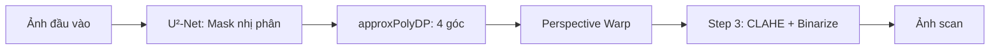
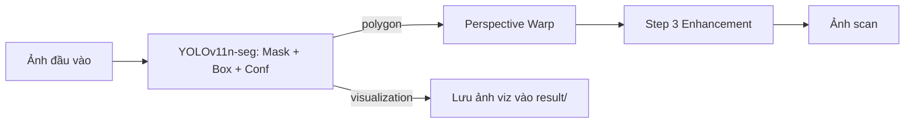

# 01 — Kế hoạch Plan B: Train & Tích hợp U²-Net + YOLO-Seg

> **Trạng thái:** ✅ **Plan B đã chốt** | Mac Studio M4 Max 48GB | 3 datasets online | Timeline 7 ngày
> **File song hành:** [02_Spec_KyThuat.md](02_Spec_KyThuat.md) (chi tiết kỹ thuật) | [03_Research_Note.md](03_Research_Note.md) (nền tảng research)
> **Mục đích file này:** Plan đầy đủ + checklist trong 1 file. Tick `[x]` các mục đã duyệt, ghi đáp án câu hỏi mở.

---

## 1. Bối cảnh & Mục tiêu

### 1.1 Bài toán
Biến ảnh chụp điện thoại (nghiêng, méo, bóng, mờ, tay che) thành **bản scan phẳng, rõ nét** — như CamScanner/Adobe Scan.

### 1.2 Hai mô hình cần train

| Task | Model | Vai trò | Variant Plan B |
|------|-------|---------|----------------|
| **A** | **U²-Netp lite** (1.1M params, 4.7MB) | Tách nền tài liệu — thay `rembg` Step 1 | Train from scratch 1 stage |
| **B** | **YOLOv11n-seg** (2.9M params, 6MB) | Phân vùng + bbox + viz — thay U²-Net | Fine-tune COCO |

### 1.3 Pipeline tích hợp

**Luồng A: U²-Net (giữ pipeline truyền thống):**


**Luồng B: YOLO (đa nhiệm + viz):**


---

## 2. Datasets (3 nguồn online — đã chốt)

### 2.1 Bảng dataset

| Dataset | Số ảnh dùng | Size tải | Vai trò | Label gốc |
|---------|-------------|----------|---------|-----------|
| **SmartDoc ICDAR 2015** | 4,000 frames | ~2GB video | Train chính — A4 trên 5 background | 4 góc XML |
| **MIDV-500** | 3,000 frames | ~9GB | ID cards, glare, occlusion | Polygon JSON |
| **Doc3D** | 5,000 ảnh subset | ~8.5GB | Giấy nhăn/cong/gập | Foreground mask + UV |
| **TỔNG** | **12,000 ảnh** | **~20GB** | Train 10,500 / Val 900 / Test 600 | |

### 2.2 Strategy split (tránh leakage)

| Dataset | Train | Val | Test | Cách split |
|---------|-------|-----|------|------------|
| SmartDoc | 3,500 | 300 | 200 | Theo `background_id` (5 background) |
| MIDV-500 | 2,500 | 300 | 200 | Theo `document_id` (50 cards) |
| Doc3D | 4,500 | 300 | 200 | Random 90/5/5 (synthetic, no leakage) |

### 2.3 5 Scenarios khó cần đảm bảo cover được

Khi đánh giá robustness, kiểm tra model trên 5 nhóm sau (3 datasets đã cover nhưng cần benchmark riêng):

1. **Occlusion** — tay người cầm/che góc giấy → MIDV-500 có nhiều
2. **Complex backgrounds** — nền trùng màu, hoa văn → SmartDoc + MIDV
3. **Lighting & shadows** — bóng đổ, glare, thiếu sáng → MIDV-500 (có glare)
4. **Physical deformations** — nhăn, gập, cong → **Doc3D (chuyên môn)**
5. **Varying types & aspect ratios** — A4, CMND, biên lai → SmartDoc (A4) + MIDV (cards)

---

## 3. Timeline 7 ngày (M4 Max 48GB)

| Ngày | Việc | Output |
|------|------|--------|
| **Hôm nay** | Claude build skeleton (~6h) — chờ duyệt checklist | 42 file code |
| **Ngày 1** | Tải datasets qua đêm | ~20GB downloaded |
| **Ngày 2** | Extract frames + parse labels | 12,000 ảnh + masks |
| **Ngày 3-4** | Train U²-Netp lite (300 epoch) — `caffeinate` chống sleep | `u2netp_doc.pth` |
| **Ngày 5** | Train YOLOv11n-seg (150 epoch) | `yolo11n_seg_doc.pt` |
| **Ngày 6** | Integration test trên pipeline | 2 pipeline chạy được |
| **Ngày 7** | Benchmark + báo cáo | `benchmark.csv` + report |

---

## 4. KPI Mục tiêu

| Metric | rembg (baseline) | U²-Netp lite mới | YOLOv11n-seg mới |
|--------|------------------|------------------|------------------|
| **mIoU** | 0.78 | ≥ 0.83 | ≥ 0.81 |
| **F1 (Dice)** | 0.82 | ≥ 0.87 | ≥ 0.85 |
| **Boundary F1** | 0.65 | ≥ 0.76 | ≥ 0.72 |
| **Corner RMSE (px)** | ~25 | < 15 | < 18 |
| **FPS (MPS)** | 8 | ≥ 20 | ≥ 35 |
| **FPS (CoreML)** | N/A | ≥ 28 | ≥ 55 |
| **OCR-CER (VN)** | 8.5% | < 7.5% | < 8.0% |
| **Model size** | 176MB (rembg) | 4.7MB | 6MB |

→ **Cải thiện kỳ vọng:** mIoU +5-7%, FPS 3-5×, model size giảm 30-40×.

---

## 5. ✅ Checklist duyệt phạm vi

### 5.1 Tổng thể

- [x] **Plan đã chọn:** Plan B
- [x] **Hardware:** Mac Studio M4 Max 48GB
- [x] **Datasets:** SmartDoc + MIDV-500 + Doc3D (online)
- [x] **Bỏ DUTS-TR pretrain** (data đích đã đủ 12K)
- [x] **Bỏ synthetic generator** (Doc3D đã có sẵn 100K synthetic)
- [ ] **Tôi đồng ý train 5-7 ngày trên M4 Max**
- [ ] **Tôi sẽ tự viết báo cáo bảo vệ** (Claude giải thích code khi tôi hỏi)

### 5.2 Phạm vi 42 file code (chi tiết: [02_Spec_KyThuat.md](02_Spec_KyThuat.md))

> **Trạng thái build:** ⏸️ **Chưa build** — đang ở giai đoạn duyệt plan. Khi user nói "OK build" thì Claude mới tạo `ml2/`.

| Module | File | Vai trò |
|--------|------|---------|
| Foundation (3) | requirements + .gitignore + README | Cài đặt + cấu trúc |
| U²-Net (11) | model + loss + dataset + aug + train + eval + infer + viz + 3 configs | Train U²-Netp lite |
| YOLO (7) | prepare + train + eval + viz + demo + tta + export | Fine-tune YOLOv11n |
| Integration (5) | u2net_wrapper + yolo_wrapper + 2 pipelines + test | Tích hợp vào pipeline cũ |
| Benchmark (5) | 4 KPI scripts + aggregate | Đo KPI 4 chiều |
| Scripts (7) | download + 3 prepare + dummy + check_env + caffeinate | Hỗ trợ |
| Notebooks (4) | u2net + yolo + integration + benchmark demo | Demo |
| **TỔNG** | **42 file** dự kiến | ~4,500 dòng code |

### 5.3 Tuỳ chọn kỹ thuật

- [ ] Bỏ `pydensecrf` — khó build trên macOS ARM
- [ ] Giữ `coremltools` cho mobile demo (M4 Max có Neural Engine)
- [ ] Bỏ Tesseract OCR mặc định — chỉ cài khi cần `kpi_e2e.py`
- [ ] Default batch_size = 16 (M4 Max 48GB đủ rộng)
- [ ] Tắt AMP mặc định (MPS AMP còn buggy PyTorch 2.x)
- [ ] U²-Netp lite 300 epoch, input 320
- [ ] YOLOv11n 150 epoch, imgsz 640

### 5.4 Ablation tối thiểu cho báo cáo

- [ ] U²-Net: BCE-only vs +IoU vs +SSIM (3 short runs)
- [ ] YOLO: Fine-tune COCO vs from-scratch (2 runs)
- [ ] Per-dataset eval: SmartDoc / MIDV / Doc3D (insight quan trọng)

### 5.5 Lệnh chạy mẫu

```bash
# Setup
source venv_ml2/bin/activate
pip install -r ml2/requirements.txt
python ml2/scripts/check_environment.py

# Test code chạy được (dummy data)
python ml2/scripts/build_dummy_data.py --n 100
python ml2/u2net/train.py --config ml2/u2net/configs/mps_mini.yaml --dummy --epochs 1

# Tải datasets thật
python ml2/scripts/download_datasets.py --smartdoc --midv500 --doc3d --subset

# Prepare labels
python ml2/scripts/prepare_smartdoc.py
python ml2/scripts/prepare_midv.py
python ml2/scripts/prepare_doc3d.py

# Train (chạy đêm với caffeinate)
caffeinate -i python ml2/u2net/train.py --config ml2/u2net/configs/doc_lite_planB.yaml
caffeinate -i python ml2/yolo_seg/train.py --epochs 150 --device mps

# Benchmark
python ml2/benchmark/aggregate_results.py
```

---

## 6. ✅ Câu hỏi đã trả lời

| # | Câu hỏi | Đáp án |
|---|---------|--------|
| Q1 | Deadline đồ án? | **1 tuần** (gấp — cần A+ cấp tốc) |
| Q2 | Báo cáo nộp tiếng Việt hay Anh? | **Tiếng Việt** |
| Q3 | Mục tiêu điểm? | **A+ xuất sắc** |
| Q4 | M4 Max có thể chạy xuyên đêm 5-7 ngày liên tục không? | **Có** — train liên tục được |
| Q5 | Có muốn script auto pause/resume train theo phiên? | **Không** — build tự động toàn diện trước |
| Q6 | Có muốn CoreML export để demo iOS/macOS? | **Không** — tạm dùng PyTorch `.pt` thông thường |

### Hệ quả cho code:
- ⏱️ **Deadline 1 tuần + A+** → Phải build TẤT CẢ code skeleton **ngay**, không chia phase
- 🇻🇳 **Tiếng Việt** → Comments + docstrings + báo cáo bằng tiếng Việt
- 🔁 **Không pause/resume** → Training script đơn giản, dùng `caffeinate` chống sleep
- 📦 **PyTorch .pt only** → Bỏ `coremltools` khỏi requirements, chỉ giữ `onnx` cho export tuỳ chọn

---

## 7. 🚦 Action sau khi duyệt

1. Tick các checkbox ở section 5
2. Trả lời 6 câu hỏi section 6 (edit trực tiếp file này)
3. → Tôi bắt đầu build 40 file còn lại theo thứ tự trong [02_Spec_KyThuat.md](02_Spec_KyThuat.md) §6.

---

*Plan B chính thức. Mọi quyết định cũ đã được archive vào [_archive/older_plans/](_archive/older_plans/).*
