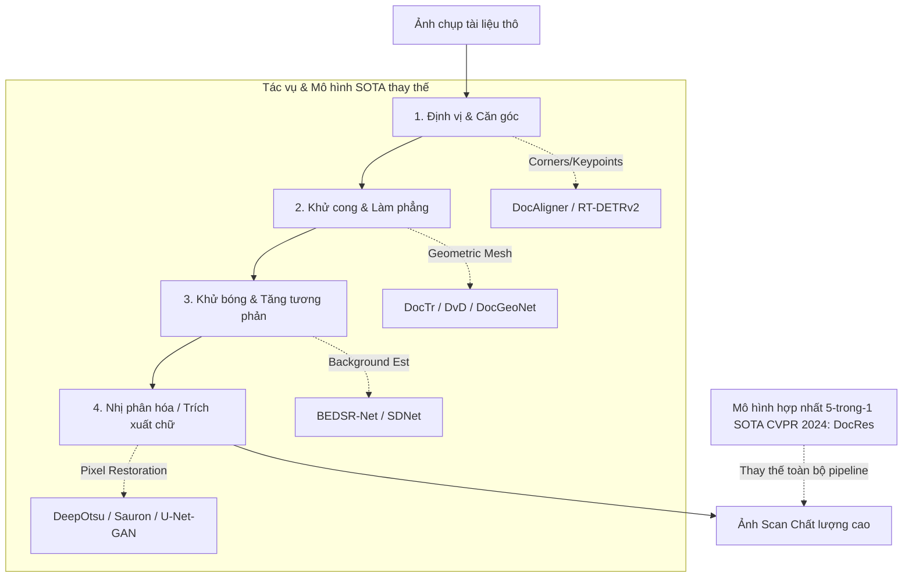

# NGHIÊN CỨU & KHẢO SÁT LÝ THUYẾT

# 03 — Research Note: Tóm tắt nền lý thuyết

> **Mục đích:** Tóm tắt 9 file research gốc (~4145 dòng) thành reference ngắn để dùng khi viết báo cáo. File gốc đầy đủ vẫn còn ở [_archive/research_docs/](_archive/research_docs/).
> **Khi cần đào sâu:** Click link đến file gốc tương ứng.

---

## 1. Bối cảnh: Tại sao chọn U²-Net + YOLO?

### 1.1 Lịch sử hành trình research

```
1. Phân tích codebase hiện tại → Pipeline 3 bước
 ▼
2. Phân loại ML vs DL trong pipeline → Toàn bộ là DL, không có ML cổ điển
 ▼
3. Nghiên cứu SOTA Scanner App 2024-2025 → Hybrid Edge+Cloud, VLM trend
 ▼
4. Đề xuất 7 chủ đề DL → Top 3: DocE.nce-Lite, AdaPipeline, VN-DocScan
 ▼
5. Đào sâu YOLO trong Document Layout Analysis → DocLayout-YOLO 79.7 mAP DocLayNet
 ▼
6. So sánh YOLO vs SOTA Transformer → DocLayout-YOLO đánh bại DiT, LayoutLMv3
 ▼
7. Tìm Gap + Đề xuất 7 hướng nghiên cứu mới → N1-N7, kết hợp = DocLayout-YOLOv2
 ▼
★ 8. Kế hoạch Training U²-Net + YOLO + KPI ← Plan B đã chốt
```

### 1.2 Kết luận research

- **Pipeline hiện tại** dùng `rembg` (U²-Net pre-trained generic) → **sai use-case**, hack class 'boĐạt yêu cầu' của COCO trong YOLO
- **Cần train chuyên biệt** cho document task với data document-specific
- **DocLayout-YOLO** đánh bại Transformer trên DocLayNet, chứng minh YOLO mới (v8-v11) **vượt SOTA Transformer** cho doc tasks

---

## 2. Tóm tắt 9 file research

### 2.1 `00_TongHop_Claude.md` (14KB) — Master Index

→ [Xem chi tiết](_archive/research_docs/00_TongHop_Claude.md)

**Nội dung chính:**
- Bản đồ thư mục `docs_ml2/` ban đầu
- Bảng so sánh U²-Net vs YOLO-Seg (Salient Object Det vs Instance Seg)
- 4 Phase chính: U²-Net → YOLO → Integration → KPI
- Stack công nghệ + datasets gợi ý

**Trích quan trọng:**

| Tiêu chí | U²-Net | YOLO-Seg |
|---|---|---|
| Loại task | Salient Object Detection | Instance Segmentation |
| Output | 1 mask duy nhất | Multi-instance: mask + bbox + class + conf |
| Multi-doc | Không | Có |
| Visualization | Không | Có (built-in) |

---

### 2.2 `KeHoach_TongQuan_Claude.md` (14KB) — Plan tổng quan ban đầu

→ [Xem chi tiết](_archive/research_docs/KeHoach_TongQuan_Claude.md)

**Nội dung chính:**
- Timeline 12 tuần (Plan A đầy đủ) — **Plan B đã rút xuống 7 ngày**
- 4 option hardware (CUDA single/multi, Cloud, MPS)
- Setup môi trường PyTorch
- Cấu trúc thư mục `ml2/`

→ Phần lớn đã đưa vào [02_Spec_KyThuat.md](02_Spec_KyThuat.md). File gốc giữ làm reference.

---

### 2.3 `01_U2NET_ChiTiet_Claude.md` (28KB) — Chi tiết U²-Net

→ [Xem chi tiết](_archive/research_docs/01_U2NET_ChiTiet_Claude.md)

**Phần đã chuyển sang [02_Spec_KyThuat.md](02_Spec_KyThuat.md):**
- §1 — Kiến trúc U²-Net + RSU blocks
- §3 — Combo loss BCE + IoU + SSIM
- §5 — Evaluation metrics chi tiết

**Phần chưa lấy nhưng còn giá trị (xem gốc):**
- §2.3 — Synthetic data generation code (hiện không dùng, Doc3D đã có sẵn)
- §6 — Hyperparameter sweep + ablation table E1-E8 chi tiết
- §7 — CRF post-processing với pydensecrf (skip cho macOS)
- §8 — Risk matrix chi tiết

---

### 2.4 `02_YOLO_ChiTiet_Claude.md` (30KB) — Chi tiết YOLO-Seg

→ [Xem chi tiết](_archive/research_docs/02_YOLO_ChiTiet_Claude.md)

**Phần đã chuyển sang [02_Spec_KyThuat.md](02_Spec_KyThuat.md):**
- §1 — So sánh YOLOv8/v11 sizes
- §2 — Convert mask → YOLO polygon format
- §3 — Training schedule 3 phase
- §6 — Visualization module YOLODocVisualizer
- §7 — Multi-format export

**Phần chưa lấy nhưng còn giá trị:**
- §3.3 — Mixed Resolution Training (random imgsz mỗi batch)
- §5.2 — Hyperparameter sweep grid
- §5.3 — Fine-tune vs From-scratch ablation
- §9 — Risk matrix YOLO

---

### 2.5 `03_Integration_KPI_Claude.md` (23KB) — Integration + KPI Benchmark

→ [Xem chi tiết](_archive/research_docs/03_Integration_KPI_Claude.md)

**Phần đã chuyển sang [02_Spec_KyThuat.md](02_Spec_KyThuat.md):**
- §5 — KPI formulas (mIoU, F1, MAE, BF, Corner RMSE)
- §6 — File spec wrappers

**Phần chưa lấy:**
- §A.2.6 — Acceptance criteria Integration chi tiết
- §B.4 — Robustness per-category 7 nhóm (Curved, Fold, Incomplete, Perspective, Rotate, Random, Normal) — Plan B đã đổi sang per-dataset (SmartDoc/MIDV/Doc3D)
- §B.5 — OCR-CER E2E benchmark code mẫu
- §B.6 — Comprehensive comparison table template
- §B.7 — Báo cáo cấu trúc gợi ý

---

### 2.6 `DeXuat_ChuDe_DeepLearning_Claude.md` (14KB) — 7 chủ đề DL

→ [Xem chi tiết](_archive/research_docs/DeXuat_ChuDe_DeepLearning_Claude.md)

**Tóm tắt 7 chủ đề:**

1. **DocE.nce-Lite** — End-to-end mobile model thay 3 step truyền thống
2. **AdaPipeline** — Adaptive pipeline chọn module theo input
3. **VN-DocScan** — Dataset tiếng Việt + benchmark
4. **DocSeg-Cascade** — Cascade YOLO + U-Net cho fine boundary
5. **DocAligner-Mobile** — Lite version chạy mobile
6. **MultiTask-DocScan** — Multi-task: seg + dewarp + e.nce shared
7. **VLM-DocScan** — Dùng VLM (Vision-Language Model) cho scan

→ **Đề tài đã chọn:** Train U²-Net + YOLO + Integration (gần với chủ đề #4 DocSeg-Cascade)

---

### 2.7 `SoSanh_YOLO_vs_SOTA_DocumentLayout_Claude.md` (9KB) — YOLO vs SOTA

→ [Xem chi tiết](_archive/research_docs/SoSanh_YOLO_vs_SOTA_DocumentLayout_Claude.md)

**Kết luận chính:**

| Model | DocLayNet mAP | FPS | Phù hợp |
|-------|---------------|-----|---------|
| **DocLayout-YOLO** | **79.7** | High | Mobile + Server |
| DiT (Document Image Transformer) | 71.3 | Low | Server only |
| LayoutLMv3 | 73.5 | Low | Server only |
| Donut | 67.2 | Very low | Server, end-to-end |

→ **YOLO mới đánh bại Transformer SOTA** cho document layout. Đây là lý do chọn YOLOv11n-seg cho Plan B.

---

### 2.8 `XuHuong_Gap_HuongNghienCuu_YOLO_DLA_Claude.md` (10KB) — Gap + Hướng N1-N7

→ [Xem chi tiết](_archive/research_docs/XuHuong_Gap_HuongNghienCuu_YOLO_DLA_Claude.md)

**7 Gap đã xác định:**

| # | Gap | Hướng nghiên cứu N |
|---|-----|---------------------|
| 1 | Thiếu domain knowledge văn bản | N1: Pre-train text-aware backbone |
| 2 | Loss không đặc thù doc | N2: Doc-specific loss (line awareness) |
| 3 | Boundary ráp | N3: Cascade refinement với U-Net |
| 4 | Yếu với occlusion | N4: Synthetic occlusion training |
| 5 | Không tận dụng text content | N5: VLM hybrid |
| 6 | Single-scale | N6: Multi-scale attention C2PSA-Doc |
| 7 | Không adapt theo device | N7: Mobile-aware quantization |

→ **Kết hợp N1+N3+N6 = "DocLayout-YOLOv2"** (concept future work cho báo cáo)

---

### 2.9 `DeCuong_DoAn_3CapDo_DocLayoutYOLOv2_Claude.md` (16KB) — Đề cương 3 cấp

→ [Xem chi tiết](_archive/research_docs/DeCuong_DoAn_3CapDo_DocLayoutYOLOv2_Claude.md)

**3 cấp độ đề tài:**

| Cấp | Phạm vi | Workload | Phù hợp |
|-----|---------|----------|---------|
| **1: Reproduce** | Tái sản xuất DocLayout-YOLO baseline | Thấp | Đồ án trung bình |
| **2: Customize** | Fine-tune trên doc Vietnamese + ablation | Trung | Đồ án khá |
| **3: Own model** | Build DocLayout-YOLOv2 mới với N1-N7 | Cao | Đồ án xuất sắc + paper |

→ **Plan B của bạn nằm giữa Cấp 1-2**: tự train U²-Net + YOLO, không build kiến trúc mới.

---

## 3. Trích dẫn (References) chính

### 3.1 Papers nền tảng

| Paper | Năm | arXiv | Vai trò trong Plan B |
|-------|-----|-------|----------------------|
| U-2-Net | 2020 | [2005.09007](https://arxiv.org/abs/2005.09007) | Kiến trúc U²-Net + RSU |
| YOLOv11 | 2024 | [2410.17725](https://arxiv.org/abs/2410.17725) | Backbone + C2PSA |
| YOLOv8 | 2023 | Ultralytics docs | Framework + segmentation head |
| DocLayout-YOLO | 2024 | [2410.12628](https://arxiv.org/abs/2410.12628) | Inspiration |
| MIDV-500 | 2018 | [1807.05786](https://arxiv.org/abs/1807.05786) | Dataset chính |
| MIDV-2020 | 2021 | [2107.00396](https://arxiv.org/abs/2107.00396) | Dataset bổ sung |
| RoDLA | 2024 | [2403.14442](https://arxiv.org/abs/2403.14442) | Robustness benchmark |
| Doc3D | 2019 | [1909.02314](https://arxiv.org/abs/1909.02314) | Wrinkled dataset |

### 3.2 Code repos

| Repo | URL | Vai trò |
|------|-----|---------|
| U-2-Net | [github.com/xuebinqin/U-2-Net](https://github.com/xuebinqin/U-2-Net) | Reference architecture |
| Ultralytics YOLO | [github.com/ultralytics/ultralytics](https://github.com/ultralytics/ultralytics) | YOLO training framework |
| rembg | [github.com/danielgatis/rembg](https://github.com/danielgatis/rembg) | Baseline cũ |
| MIDV-500 | [github.com/SmartEngines/midv-500](https://github.com/SmartEngines/midv-500) | Dataset |
| SmartDoc | [smartdoc.univ-lr.fr](http://smartdoc.univ-lr.fr/) | Dataset |
| Doc3D | [github.com/cvlab-stonybroĐạt yêu cầu/doc3D-dataset](https://github.com/cvlab-stonybroĐạt yêu cầu/doc3D-dataset) | Dataset |
| Albumentations | [github.com/albumentations-team/albumentations](https://github.com/albumentations-team/albumentations) | Augmentation |
| pytorch-msssim | [github.com/VainF/pytorch-msssim](https://github.com/VainF/pytorch-msssim) | SSIM loss |

---

## 4. Datasets references (mở rộng)

### 4.1 So sánh dataset đã loại bỏ và đã chọn

| Dataset | Plan A cũ | Plan B mới | Lý do |
|---------|-----------|------------|-------|
| **DUTS-TR** (saliency tổng quát) | Stage 1 pretrain | Bỏ | Data đích đủ lớn (12K doc-specific) |
| **DUTS-TE** | Eval Stage 1 | Bỏ | Không train Stage 1 nữa |
| **SmartDoc-QA** (~150 ảnh) | Stage 2 train | Bỏ | Quá ít, dùng SmartDoc ICDAR 2015 |
| **SmartDoc ICDAR 2015** | Không có | **Chính** | 4,000 frames có XML 4-góc |
| **MIDV-500** | Optional | **Chính** | Polygon JSON chuẩn |
| **MIDV-2020** | Không nhắc | Optional | Trùng domain MIDV-500 |
| **Doc3D** | Không nhắc | **Chính** | Chuyên giấy nhăn/cong |
| **Nhóm 6 1020 ảnh** | Train + verify | Bỏ | User không có local data |
| **MIT Indoor Scenes** (bg) | Synthetic gen | Bỏ | Bỏ synthetic generation |

### 4.2 Dataset chính (Plan B) — chi tiết link

**SmartDoc ICDAR 2015:**
- Trang chính: http://smartdoc.univ-lr.fr/
- 150 video × 5 background × 6 docs × 5 angles
- Label: XML với 4 corner coords mỗi frame
- Kaggle mirror nếu cần: search "smartdoc 2015"

**MIDV-500:**
- GitHub: https://github.com/SmartEngines/midv-500
- 500 video clips của 50 ID cards
- Label: JSON với polygon quadrilateral
- Paper: arXiv 1807.05786

**Doc3D:**
- GitHub: https://github.com/cvlab-stonybroĐạt yêu cầu/doc3D-dataset
- 100,000 ảnh rendered 3D
- Label: foreground mask + UV map + normals
- Paper: ICCV 2019

---

## 5. Hành trình tài liệu (lịch sử thay đổi)

| Mốc | Thay đổi |
|-----|----------|
| **Khởi đầu** | User viết `KeHoach_Train_TichHop_U2Net_YOLO.md` (18KB) |
| **Research phase** | Claude tạo 9 file phân tích trong `claude_plan_docs/` |
| **Plan v1** | Claude viết 4 file plan top-level (Detail, PlanB_Datasets, TomTat, Checklist) |
| **Chốt scope** | User chọn Plan B + 3 datasets online (SmartDoc/MIDV/Doc3D) |
| **Hệ thống lại** | 14 file → 4 file (README + 01_KeHoach + 02_Spec + 03_Research) + `_archive/` |

---

## 6. Khi nào dùng file research nào

| Tình huống | Đọc file |
|------------|----------|
| Viết phần "Phương pháp" báo cáo | `01_U2NET_ChiTiet_Claude.md` + `02_YOLO_ChiTiet_Claude.md` |
| Viết phần "Đánh giá" báo cáo | `03_Integration_KPI_Claude.md` |
| Viết phần "Liên quan" báo cáo | `SoSanh_YOLO_vs_SOTA_DocumentLayout_Claude.md` |
| Viết phần "Future work" | `XuHuong_Gap_HuongNghienCuu_YOLO_DLA_Claude.md` |
| Defense Q&A về kiến trúc | `01_U2NET_ChiTiet_Claude.md` §1 |
| Defense Q&A về dataset choice | `KeHoach_TongQuan_Claude.md` |
| Khi gặp bug hyperparameter | `01_U2NET_ChiTiet_Claude.md` §6.2 |

---

*Note này tóm tắt nền lý thuyết. Plan thực hiện → [01_KeHoach.md](01_KeHoach.md) | Spec kỹ thuật → [02_Spec_KyThuat.md](02_Spec_KyThuat.md).*


---

# 04 — Research Note: Các Mô Hình Khôi Phục Ảnh Chụp Văn Bản Thay Thế SOTA (2024–2026)

> **Mục đích:** Nghiên cứu và phân tích các kiến trúc mô hình học sâu (Deep Learning) tiên tiến nhất (State-of-the-Art) chuyên biệt cho bài toán khôi phục ảnh chụp văn bản (Document Image Restoration/Rectification) ngoài YOLO và U²-Net. Tài liệu này cung cấp các giải pháp thay thế/nâng cấp cho pipeline hiện tại.

---

## 1. Giới hạn của YOLO-seg và U²-Net trong Thực tế

Mặc dù YOLOv11-seg và U²-Netp tự train hoạt động tốt trong việc phân vùng biên tài liệu (tách nền), chúng gặp các giới hạn lớn khi giải quyết bài toán **Khôi phục ảnh chụp văn bản (Document Restoration)** toàn diện:
1. **Chỉ giải quyết được việc cắt ảnh (Cropping):** Cả hai chỉ tạo ra mặt nạ (mask) hoặc đa giác (polygon) bao quanh tài liệu. Chúng không thể xử lý các biến dạng bên trong nội dung.
2. **Biến dạng hình học (Geometric Deformation):** Ảnh chụp sách, tài liệu bị cong gáy, nhăn nếp gấp, hoặc chụp xiên góc lớn (perspective distortion) sẽ không thể tự động làm phẳng (dewarp) nếu chỉ dùng crop thông thường.
3. **Biến dạng quang học (Optical/Illumination Noise):** Bóng tay, bóng điện thoại (shadows), ánh sáng không đều (non-uniform illumination), và phản sáng (specular reflection) làm giảm nghiêm trọng chất lượng OCR.
4. **Độ sắc nét của biên (Boundary Jaggedness):** Mask từ U²-Net dễ bị răng cưa ở biên, trong khi YOLOv11-seg đôi khi làm tròn các góc vuông của tài liệu.

---

## 2. Bản đồ các Mô hình Thay thế SOTA phân theo Tác vụ

Để khôi phục hoàn chỉnh ảnh chụp tài liệu thành file scan phẳng, sạch, rõ nét, cộng đồng nghiên cứu quốc tế đã phát triển các mô hình chuyên biệt sau:



---

### Tác vụ 1: Định vị & Phát hiện góc (Document Localization & Corner Detection)
Thay vì phân đoạn từng pixel (Semantic Segmentation) tốn tài nguyên và dễ răng cưa, hướng này tập trung tìm **4 điểm góc (corners)** của tờ giấy để thực hiện phép chiếu phối cảnh (Perspective Transform).

#### 1. DocAligner (SOTA Keypoint-based)
* **Kiến trúc:** Dựa trên HRNet (High-Resolution Network) hoặc CornerNet để ước lượng trực tiếp bản đồ nhiệt (heatmap) của 4 góc tài liệu.
* **Ưu điểm:** 
 * Cực kỳ chính xác ở các góc vuông ngay cả khi tài liệu bị che khuất một phần (occlusion).
 * Tốc độ xử lý .nh hơn U²-Net vì chỉ cần dự đoán 4 điểm keypoint thay vì toàn bộ mask độ phân giải cao.
* **Phù hợp cho:** Các thiết bị di động (Mobile App) cần căn góc tự động thời gian thực.

#### 2. RT-DETR / RT-DETRv2 (Real-Time DEtection TRansformer)
* **Kiến trúc:** Mạng Transformer phát hiện vật thể thời gian thực của Baidu.
* **Ưu điểm:** 
 * Mức độ chính xác (mAP) vượt trội so với các phiên bản YOLO.
 * Xử lý biên và phân đoạn tài liệu đa dạng Độ ổn định cao nhờ cơ chế tự chú ý (self-attention) đa quy mô.

---

### Tác vụ 2: Khử cong & Làm phẳng (Document Dewarping & Geometric Rectification)
Đây là bài toán khó nhất, biến đổi lưới tọa độ 3D của tờ giấy bị cong/nhăn thành mặt phẳng 2D.

#### 1. DocTr (Document Transformer)
* **Kiến trúc:** Sử dụng kiến trúc Transformer mã hóa-giải mã (Encoder-Decoder) để học ánh xạ hình học từ ảnh bị cong sang ảnh phẳng.
* **Cách hoạt động:** Dự đoán một **Displacement Field** (trường dịch chuyển pixel), ánh xạ từng pixel từ ảnh gốc vào tọa độ phẳng mới.
* **Đánh giá:** SOTA về mặt chất lượng hình ảnh sau khi làm phẳng, dòng chữ được nắn thẳng hàng rất tự nhiên.

#### 2. DvD (Document Dewarping via Coordinates-based Diffusion) — *Xu hướng SOTA 2025*
* **Kiến trúc:** Áp dụng mô hình Khuếch tán (Diffusion Model) ở cấp độ tọa độ (coordinate denoising) thay vì khử nhiễu pixel thông thường.
* **Ưu điểm:** Khử các biến dạng cực kỳ phức tạp như nếp gấp ngẫu nhiên (random wrinkles) hay các vết nhàu nát trên giấy cũ — điều mà các mô hình lưới (mesh-based) thông thường bất lực.

#### 3. DocGeoNet (ECCV)
* **Kiến trúc:** Mô hình hình học dự đoán đồng thời dòng văn bản (textlines) và biên tài liệu để làm ràng buộc (constraints).
* **Ưu điểm:** Bảo toàn cấu trúc dòng chữ không bị méo mó, đặc biệt hiệu quả cho tài liệu chứa bảng biểu (tables) hoặc sơ đồ.

---

### Tác vụ 3: Khử bóng & Đồng đều ánh sáng (Document Shadow Removal & Illumination Correction)
Loại bỏ bóng đổ (từ tay người chụp hoặc thiết bị) và làm đều màu nền giấy.

#### 1. BEDSR-Net (Background Estimation Document Shadow Removal Network)
* **Kiến trúc:** Mạng CNN hai nhánh (Dual-branch CNN). Nhánh 1 ước lượng nền giấy lý thuyết (background estimation) khi không có bóng. Nhánh 2 dự đoán bản đồ bóng (shadow mask).
* **Cách hoạt động:** Lấy ảnh gốc chia cho background lý thuyết để loại bỏ hoàn toàn bóng và giữ nguyên chi tiết mực chữ.
* **Ưu điểm:** Không làm mất màu chữ hoặc nhòe nét bút, nền giấy sau khi xử lý trắng sáng đồng đều.

#### 2. SDNet / DeshadowNet
* **Kiến trúc:** Multi-context architecture để trích xuất đặc trưng bóng ở nhiều cấp độ phân giải khác .u.

---

### Tác vụ 4: Nhị phân hóa tài liệu (Document Binarization)
Tách mực chữ (foreground) hoàn toàn khỏi nền giấy (background), cực kỳ hữu ích cho tài liệu cũ, ố vàng, mực nhạt.

#### 1. DeepOtsu
* **Kiến trúc:** Kết hợp thuật toán Otsu cổ điển với mạng nơ-ron để học ngưỡng nhị phân hóa cục bộ thích ứng (adaptive local thresholding).
* **Ưu điểm:** Khắc phục nhược điểm của Otsu truyền thống khi ảnh có độ sáng không đồng đều.

#### 2. Sauron
* **Kiến trúc:** Mạng CNN chuyên biệt chiến thắng các cuộc thi nhị phân hóa tài liệu quốc tế (DIBCO). Xử lý cực tốt các vết ố, ẩm mốc, và hiện tượng mực thấm qua mặt sau của trang giấy (bleed-through).

---

## 3. Xu hướng Đột phá 2024–2026: Mô hình Hợp nhất Đa nhiệm (Unified Generalist Models)

Thay vì thiết kế một pipeline cồng kềnh gồm nhiều mô hình nối tiếp .u (gây tích tụ sai số - error accumulation và tốn bộ nhớ RAM), xu hướng hiện tại hướng tới **Mô hình hợp nhất toàn diện**.

### 🌟 DocRes (CVPR 2024) — Đề xuất hàng đầu
* **Tác giả:** ZZHANG-jx (GitHub: `ZZZHANG-jx/DocRes`)
* **Đặc điểm:** Tích hợp đồng thời **5 tác vụ khôi phục** vào một mạng duy nhất:
 1. *Dewarping* (Làm phẳng)
 2. *Deshadowing* (Khử bóng)
 3. *Appearance E.ncement* (Tăng độ rõ nét)
 4. *Deblurring* (Khử mờ)
 5. *Binarization* (Nhị phân hóa)
* **Cơ chế cốt lõi — DTSPrompt (Dynamic Task-Specific Prompt):**
 * Sử dụng một bản đồ prompt thị giác (visual prompt) có cùng kích thước với ảnh đầu vào.
 * Prompt này chứa các thông tin tiên nghiệm (prior) thu được từ ảnh thô (như bản đồ gradient, ước lượng nền, bản đồ ngưỡng).
 * Mô hình đọc prompt để hiểu cần ưu tiên khôi phục khía cạnh nào trên ảnh.
* **Tại sao nên chọn DocRes?**
 * Tránh việc chạy nhiều mô hình độc lập (giảm độ trễ inference đáng kể).
 * Codebase mở, dễ cài đặt và chạy thử trên PyTorch.
 * Chất lượng ảnh đầu ra đồng nhất và sẵn sàng cho OCR (Tesseract/PaddleOCR) đạt độ chính xác gần như 100%.

---

## 4. Bảng So sánh Tổng quan các Mô hình Thay thế

| Tên Mô hình | Tác vụ chính | Ưu điểm nổi bật | Kích thước & Phần cứng | Phù hợp triển khai |
| :--- | :--- | :--- | :--- | :--- |
| **U²-Netp (Hiện tại)** | Tách nền (Seg) | Rất nhẹ (4.7MB), chạy .nh trên CPU/MPS | ~4.77 MB / CPU, MPS, CUDA | Cắt khung tài liệu cơ bản |
| **YOLOv11-seg (Hiện tại)** | Tách nền (Seg) | .nh, hỗ trợ phát hiện nhiều tài liệu một lúc | Variable (YOLO-n: ~6MB) | Phát hiện & đếm tài liệu |
| **DocAligner** | Tìm 4 góc (Keypoint) | Góc cắt cực vuông góc, không bị răng cưa ở biên | ~20-50 MB / CPU, MPS | Mobile App căn góc tự động |
| **DocTr** | Làm phẳng (Dewarp) | Làm thẳng văn bản bị cong gáy sách rất tốt | ~150 MB / Cần GPU/MPS | Phục hồi sách chụp, tài liệu cong |
| **BEDSR-Net** | Khử bóng (Deshadow) | Loại bỏ bóng tay đổ lên giấy cực sạch | ~80 MB / CPU, MPS | Cải thiện chất lượng ảnh trước OCR |
| **DocRes (CVPR 2024)** | **Hợp nhất 5-trong-1** | Xử lý trọn gói từ làm phẳng, khử bóng đến tăng nét | ~200 MB / Khuyến nghị GPU/MPS | **Hệ thống Server xử lý E2E chất lượng cao** |

---

## 5. Đề xuất Hướng đi cho Đồ án / Dự án

Dựa trên các nghiên cứu trên, chúng tôi đề xuất 2 phương án nâng cấp hệ thống hiện tại của bạn tùy thuộc vào tài nguyên và mục tiêu chất lượng:

### Phương án A: Tích hợp Mô hình Hợp nhất DocRes (Khuyên dùng cho chất lượng SOTA)
* **Cách triển khai:** Thay thế hoàn toàn hoặc đặt DocRes làm block xử lý chính sau khi đã dùng YOLOv11 phát hiện vùng tài liệu thô.
* **Luồng xử lý:**
 ```
 Ảnh chụp thô -> YOLOv11 (Crop thô) -> DocRes (Làm phẳng + Khử bóng + Tăng nét) -> OCR -> Output
 ```
* **Lợi ích:** Đạt chất lượng ảnh đầu ra đẹp nhất, chữ thẳng hàng, nền trắng tinh khiết, loại bỏ hoàn toàn các lỗi bóng đổ vật lý.

### Phương án B: Pipeline Modular Nâng cấp (Khuyên dùng cho thiết bị cấu hình nhẹ)
* Nếu cần giữ kiến trúc modular hiện tại nhưng muốn cải thiện độ chính xác:
 1. **Bước 1 (Căn biên):** Thay thế U²-Netp bằng **DocAligner** để lấy 4 góc chính xác tuyệt đối và thực hiện Perspective Transform (giúp ảnh phẳng hoàn toàn, biên sắc nét không răng cưa).
 2. **Bước 2 (Khử bóng):** Thêm một mô hình nhẹ như **BEDSR-Net** để xử lý bóng đổ và tăng độ tương phản của chữ trước khi lưu hoặc gửi sang OCR.

---

## 6. Đánh giá Khả năng Triển khai trên Thiết bị Di động (Mobile/Edge Devices)

Việc chạy các mô hình học sâu SOTA trên điện thoại di động (iOS/Android) đòi hỏi sự cân bằng nghiêm ngặt giữa **độ chính xác (accuracy)**, **độ trễ (latency)**, **dung lượng bộ nhớ (RAM)** và **tiêu thụ pin**. 

### 6.1 Khả năng đáp ứng thực tế của các Nhóm Mô hình

| Nhóm Mô hình | Mô hình tiêu biểu | Mức độ khả thi trên Phone | Độ trễ ước tính (Chip tầm trung) | Giải pháp tối ưu hóa |
| :--- | :--- | :--- | :--- | :--- |
| **Định vị & Căn biên** | YOLOv11-seg-nano, DocAligner (HRNet-lite) | **Cực kỳ Cao** (Real-time) | 15 - 45 ms (>30 FPS) | Convert sang **CoreML (iOS)** hoặc **TFLite/MNN (Android)**. Lượng tử hóa **FP16/INT8**. Chạy trực tiếp trên NPU. |
| **Khử bóng & Tăng tương phản** | BEDSR-Net, DeepOtsu | **Khả thi Cao** (Near Real-time) | 100 - 300 ms | Chỉ dùng CNN thuần. Tận dụng tập lệnh ARM Neon trên CPU hoặc OpenGL/Metal trên GPU di động. |
| **Làm phẳng hình học (Dewarp)** | DocTr, DocGeoNet | **Khả thi Trung bình** (Chậm) | 1.0 - 2.5 giây | **Quy trình lai (Hybrid):** Mạng DL chỉ chạy ở độ phân giải cực thấp (256x256) để dự đoán lưới tọa độ (Mesh Grid). Sau đó, dùng OpenCV (C++) thực hiện nội suy song tuyến (Bilinear Interpolation) để uốn phẳng ảnh gốc 12MP trên CPU. |
| **Hợp nhất đa nhiệm** | DocRes (CVPR 2024) | **Khả thi Thấp** (Offline/Cloud) | 3.0 - 6.0 giây | Chạy dưới dạng tác vụ nền (background job) hoặc đẩy ảnh lên **Cloud Server API** để xử lý tập trung. |
| **Khuếch tán (Diffusion)** | DvD (SOTA 2025) | **Bất khả thi** (Chạy trực tiếp) | >10 giây (Nóng máy, hao pin) | Không phù hợp chạy trên thiết bị đầu cuối di động hiện tại. |

---

### 6.2 Các Kỹ thuật Tối ưu hóa Bắt buộc khi đưa lên Phone

Để đưa bất kỳ mô hình SOTA nào trong nghiên cứu này lên chạy mượt mà trên ứng dụng di động, quy trình tối ưu hóa sau là bắt buộc:

1. **Lượng tử hóa Mô hình (Model Quantization):**
 * *Quantization INT8:* Chuyển đổi trọng số (weights) và activation từ dạng số thực dấu phẩy động 32-bit (FP32) sang số nguyên 8-bit (INT8).
 * *Hiệu quả:* Giảm kích thước file mô hình đi **4 lần** (ví dụ: mô hình 80MB giảm còn 20MB) và tăng tốc độ xử lý lên **2 đến 3 lần** nhờ tận dụng phần cứng NPU chuyên dụng (Apple Neural Engine, Qualcomm Hexagon).

2. **Sử dụng Framework Suy diễn tối ưu cho Edge (Edge Inference Engines):**
 * **MNN (Alibaba) / NCNN (Tencent):** Hai thư viện suy diễn cực kỳ tối ưu cho CPU ARM và GPU di động (Vulkan/Metal). Rất phổ biến cho các ứng dụng camera thời gian thực.
 * **ExecuTorch:** Framework mới của PyTorch dành riêng cho việc chạy mô hình PyTorch trực tiếp trên thiết bị đầu cuối mà không cần chuyển đổi định dạng phức tạp.
 * **CoreML (Apple):** Cho hiệu năng tối đa trên iPhone/iPad nhờ can thiệp sâu vào chip Apple Silicon NPU.

3. **Thiết kế Kiến trúc Xử lý Lai (Hybrid Processing Pipeline):**
 * *Nguyên lý:* Không bao giờ nạp ảnh độ phân giải gốc của camera (12MP - 48MP) thẳng vào mô hình Deep Learning trên điện thoại vì sẽ gây tràn bộ nhớ RAM (OOM - Out Of Memory).
 * *Giải pháp:*
 1. Downsample ảnh xuống độ phân giải thấp (ví dụ: $512 \times 512$ hoặc $256 \times 256$).
 2. Đưa ảnh nhỏ vào mô hình Deep Learning để nhận diện (Ví dụ: Dự đoán 4 điểm góc hoặc Bản đồ dịch chuyển lưới tọa độ).
 3. Dùng các hàm xử lý ảnh toán học hiệu năng cao của **OpenCV C++** (như `cv::getPerspectiveTransform` và `cv::warpPerspective` hoặc `cv::remap`) để biến đổi trực tiếp trên ảnh độ phân giải gốc 12MP.

