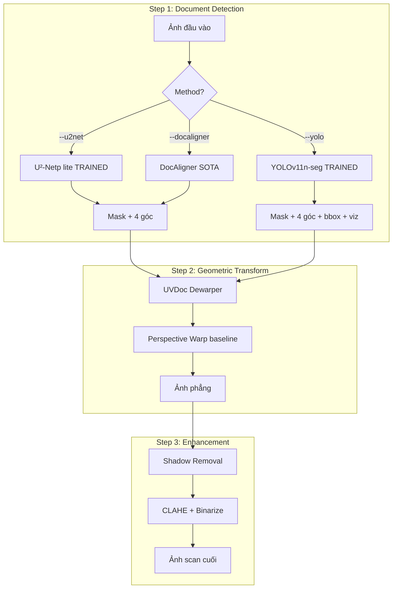

# 02 — Spec Kỹ thuật: Kiến trúc, Loss, KPI, 41 File Code

> **Mục đích:** Tất cả chi tiết kỹ thuật để Claude code đúng spec — kiến trúc model, loss function, KPI formulas, danh sách 41 file với mô tả từng cái.
> **File song hành:** [01_KeHoach.md](01_KeHoach.md) (chiến lược + checklist) | [03_Research_Note.md](03_Research_Note.md) (nền lý thuyết)

---

## 1. Kiến trúc U²-Net

### 1.1 Tổng thể

```
INPUT (3 × H × W)
       ▼
┌─────────────────────────────────────┐
│ Encoder (6 levels, downsampling):    │
│   En_1: RSU-7  (3 → 64/16)           │
│   En_2: RSU-6  (64/16 → 128/64)      │
│   En_3: RSU-5  (128/64 → 256/64)     │
│   En_4: RSU-4  (256/64 → 512/64)     │
│   En_5: RSU-4F (512/64 → 512/64)     │   ← no pooling
│   En_6: RSU-4F (512/64 → 512/64)     │
│                                      │
│ Decoder (5 levels, upsampling):      │
│   De_5 → De_4 → De_3 → De_2 → De_1   │
│                                      │
│ Side outputs (deep supervision):     │
│   6 outputs từ En_6 → De_1 + fused   │
│                                      │
│ Final: sigmoid(fused) → mask (1×H×W) │
└─────────────────────────────────────┘
```

### 1.2 Variant Plan B: U²-Netp (lite)

| | U²-Net full | **U²-Netp (Plan B)** |
|---|---|---|
| Params | 44M | **1.1M** |
| Size | 176 MB | **4.7 MB** |
| FLOPs | 87G | 1.2G |
| Mid channels | 32/16/16/16/16/16 | **16/16/16/16/16/16** |
| Out channels | 64/128/256/512/512/512 | **64/64/64/64/64/64** |
| Inference MPS | ~50ms | **~15-20ms** |
| Train time (10.5K, 300 ep, MPS) | ~36h | **~3-4 ngày** |

### 1.3 Khối RSU (Residual U-block) — building block

```
RSU-N:
   Input (C_in)
      ▼
   Conv3×3 + BN + ReLU → (C_mid)
      ▼
   ────── Inner U-Net N levels ──────
   │  E1: Conv → pool                │
   │  E2: Conv → pool                │
   │  ... đến E_N                    │
   │  Bottleneck: Dilated Conv (d=2) │
   │  D_N, D_{N-1}, ..., D_1         │
   │     với skip connections         │
   └─────────────────────────────────
      ▼
   Conv3×3 → (C_out)
      ▼
   + Conv1×1(Input)  ← residual
      ▼
   Output (C_out)
```

RSU-N variants:
- **RSU-7**: 7-level inner U-Net (cho En_1 do feature map còn lớn)
- **RSU-6, RSU-5, RSU-4**: tương tự, ít level hơn
- **RSU-4F**: 4 level **không có pooling**, dùng dilation thay (cho En_5, En_6 do feature map đã nhỏ)

---

## 2. Kiến trúc YOLO-Seg

### 2.1 YOLOv11n-seg overview

```
INPUT (3 × 640 × 640)
       ▼
┌──────────────────────────────────────┐
│ Backbone (CSPNet + C3k2 blocks)      │
│   Stem → P1 → P2 → P3 → P4 → P5      │
│   • C3k2: lightweight cross-stage    │
│   • SPPF: spatial pyramid pooling    │
└────────────────┬─────────────────────┘
                 ▼
┌──────────────────────────────────────┐
│ Neck (PAN-FPN + C2PSA attention)     │
│   • Top-down + bottom-up fusion      │
│   • C2PSA: Partial Self-Attention    │
└────────────────┬─────────────────────┘
                 ▼
┌──────────────────────────────────────┐
│ Detection Head (decoupled):          │
│   • cls + bbox + dfl                 │
│   • Anchor-free (TaskAligned)        │
│                                      │
│ Segmentation Head (ProtoNet):        │
│   • 32 prototype masks               │
│   • Linear combination: coef × proto │
└────────────────┬─────────────────────┘
                 ▼
OUTPUT (per detection):
   • bbox (x, y, w, h)
   • class_id + confidence
   • binary mask (160×160 upsampled)
```

### 2.2 Variant Plan B: YOLOv11n-seg

| | YOLOv11n-seg ⭐ | YOLOv11s-seg | YOLOv11m-seg |
|---|---|---|---|
| Params | **2.9M** | 10.1M | 22.4M |
| Size | **6MB** | 22MB | 50MB |
| FLOPs | **10.4G** | 35.5G | 123.3G |
| mAP COCO | 30.5 | 37.8 | 41.5 |
| Train MPS (150 ep) | **~12-16h** | ~36h | ~48h |

---

## 3. Loss Functions

### 3.1 U²-Net combo loss

$$\mathcal{L}_{total} = \sum_{i=0}^{6} \left( w_{BCE} \cdot \mathcal{L}_{BCE}^{(i)} + w_{IoU} \cdot \mathcal{L}_{IoU}^{(i)} + w_{SSIM} \cdot \mathcal{L}_{SSIM}^{(i)} \right)$$

Trong đó:
- $i=0$: output cuối (fused)
- $i=1..6$: 6 side outputs (deep supervision)
- $w_{BCE} = w_{IoU} = w_{SSIM} = 1.0$ (mặc định)

**Mục đích từng thành phần:**

| Loss | Công thức | Vai trò |
|------|-----------|---------|
| **BCE** | $-\frac{1}{HW}\sum [y \log\hat{y} + (1-y)\log(1-\hat{y})]$ | Pixel classification cơ bản |
| **IoU** | $1 - \frac{|A \cap B|}{|A \cup B|}$ | Structural overlap, robust với class imbalance |
| **SSIM** | $1 - \text{SSIM}(\hat{y}, y)$ | Giữ chi tiết biên + texture |
| **EdgeLoss** (optional) | L1 trên Sobel edges | Khi BF < 0.75 |

### 3.2 YOLO-Seg loss (tự động qua Ultralytics)

$$\mathcal{L}_{YOLO} = \lambda_{box} \mathcal{L}_{box} + \lambda_{cls} \mathcal{L}_{cls} + \lambda_{dfl} \mathcal{L}_{dfl} + \lambda_{seg} \mathcal{L}_{seg}$$

Defaults Ultralytics: `box=7.5`, `cls=0.5`, `dfl=1.5`, mask qua `overlap_mask=True`.

---

## 4. Augmentation Strategy

### 4.1 Augmentation pipeline (Albumentations)

**Basic (luôn dùng):**
```python
A.HorizontalFlip(p=0.5),
A.RandomBrightnessContrast(p=0.3),
A.HueSaturationValue(p=0.3),
A.Resize(320, 320),
A.Normalize(mean=[0.485, 0.456, 0.406], std=[0.229, 0.224, 0.225])
```

**Strong (cho doc data, mô phỏng ảnh điện thoại):**
```python
A.OneOf([
    A.MotionBlur(blur_limit=7),
    A.GaussianBlur(blur_limit=5),
    A.GaussNoise(var_limit=(10, 50)),
], p=0.3),
A.RandomShadow(p=0.3),
A.RandomSunFlare(p=0.2),  # mô phỏng glare cho MIDV
A.Perspective(scale=(0.05, 0.1), p=0.4),
A.Rotate(limit=15, p=0.5),
```

### 4.2 YOLO augmentation (qua Ultralytics)

```yaml
hsv_h: 0.015          # Hue
hsv_s: 0.7            # Saturation
hsv_v: 0.4            # Value
degrees: 15.0
translate: 0.1
scale: 0.5
perspective: 0.0005
fliplr: 0.5
mosaic: 1.0           # Tắt ở 20 epoch cuối
mixup: 0.15
copy_paste: 0.3       # Tốt cho seg
```

---

## 5. KPI Formulas (chi tiết)

### 5.1 Accuracy

| Metric | Công thức | Ngưỡng tốt |
|--------|-----------|------------|
| **IoU** | $\frac{|A \cap B|}{|A \cup B|}$ | ≥ 0.83 |
| **Dice/F1** | $\frac{2|A \cap B|}{|A| + |B|}$ | ≥ 0.87 |
| **MAE** | $\frac{1}{HW}\sum |\hat{y} - y|$ | < 0.05 |
| **Boundary F1** | F1 trên pixel cách viền < 2px | ≥ 0.76 |
| **Corner RMSE** | $\sqrt{\frac{1}{4}\sum_{i=1}^4 \|p_i - \hat{p}_i\|^2}$ | < 15px |

### 5.2 Speed

| Metric | Cách đo | Mục tiêu (MPS) |
|--------|---------|-----------------|
| **Median latency** | 100 ảnh, warmup 10, `torch.mps.synchronize()` | < 50ms |
| **p95 latency** | 95-percentile | < 70ms |
| **FPS** | 1000 / median_ms | ≥ 20 |

### 5.3 Detection (chỉ YOLO)

| Metric | Mục tiêu |
|--------|----------|
| **mAP@0.5 box** | ≥ 0.90 |
| **mAP@0.5:0.95 box** | ≥ 0.75 |
| **mAP@0.5 mask** | ≥ 0.85 |

### 5.4 E2E

| Metric | Cách đo |
|--------|---------|
| **PSNR** | So với GT scan |
| **SSIM** | Structural similarity |
| **OCR-CER** | Tesseract VN → char error rate vs GT text |
| **Total time** | End-to-end latency Step 1→3 |

---

## 6. Danh sách 42 File Code

### 6.1 Foundation (3 file)

| # | File | Dòng dự kiến | Vai trò |
|---|------|--------------|---------|
| 1 | `ml2/requirements.txt` | 30 | ✅ Đã có |
| 2 | `ml2/.gitignore` | 50 | ✅ Đã có |
| 3 | `ml2/README.md` | 100 | Cài đặt + chạy + tree |

### 6.2 U²-Net module (11 file)

| # | File | Dòng | Vai trò |
|---|------|------|---------|
| 4 | `ml2/u2net/__init__.py` | 5 | Export U2NET, U2NETp |
| 5 | `ml2/u2net/model.py` | 350 | RSU + U2NET + U2NETp classes |
| 6 | `ml2/u2net/loss.py` | 120 | Combo BCE+IoU+SSIM + EdgeLoss |
| 7 | `ml2/u2net/dataset.py` | 180 | DocSegDataset cho SmartDoc/Doc3D |
| 8 | `ml2/u2net/augmentation.py` | 100 | Albumentations basic + strong |
| 9 | `ml2/u2net/train.py` | 280 | Training loop + MPS + TensorBoard |
| 10 | `ml2/u2net/eval.py` | 200 | 4 metrics + per-dataset |
| 11 | `ml2/u2net/infer.py` | 150 | Inference + TTA |
| 12 | `ml2/u2net/visualize.py` | 150 | Plot curves + sample predictions |
| 13 | `ml2/u2net/configs/doc_lite_planB.yaml` | 50 | ⭐ **Config chính Plan B** |
| 14 | `ml2/u2net/configs/doc_full_optional.yaml` | 50 | Cho CUDA users |
| 15 | `ml2/u2net/configs/mps_mini.yaml` | 40 | ⭐ **Test nhanh trên MPS** |

### 6.3 YOLO-Seg module (7 file)

| # | File | Dòng | Vai trò |
|---|------|------|---------|
| 16 | `ml2/yolo_seg/prepare_dataset.py` | 200 | Convert SmartDoc XML → YOLO polygon |
| 17 | `ml2/yolo_seg/train.py` | 180 | Wrapper Ultralytics + MPS |
| 18 | `ml2/yolo_seg/eval.py` | 180 | mAP + custom mIoU + speed |
| 19 | `ml2/yolo_seg/visualize.py` | 250 | ⭐ **YOLODocVisualizer (bbox + mask + corners + info)** |
| 20 | `ml2/yolo_seg/demo_viz.py` | 80 | Batch demo + grid montage |
| 21 | `ml2/yolo_seg/infer_tta.py` | 60 | TTA inference |
| 22 | `ml2/yolo_seg/export_all.py` | 80 | ONNX + CoreML (cho M4 Max mobile) |

### 6.4 Integration (5 file)

| # | File | Dòng | Vai trò |
|---|------|------|---------|
| 23 | `ml2/pipeline_integration/u2net_wrapper.py` | 120 | Drop-in replacement cho `rembg.remove()` |
| 24 | `ml2/pipeline_integration/yolo_wrapper.py` | 150 | Wrapper YOLO + viz + corner extraction |
| 25 | `ml2/pipeline_integration/pipeline_u2net.py` | 200 | Pipeline copy + patch dùng U2NET |
| 26 | `ml2/pipeline_integration/pipeline_yolo.py` | 250 | Pipeline mới với YOLO + viz đầy đủ |
| 27 | `ml2/pipeline_integration/test_integration.py` | 80 | Test trên test set 600 ảnh |

### 6.5 Benchmark (5 file)

| # | File | Dòng | Vai trò |
|---|------|------|---------|
| 28 | `ml2/benchmark/kpi_speed.py` | 180 | CPU + MPS + CoreML latency |
| 29 | `ml2/benchmark/kpi_accuracy.py` | 200 | 4 metrics so sánh song song |
| 30 | `ml2/benchmark/kpi_robustness.py` | 150 | Per-dataset (SmartDoc / Doc3D) |
| 31 | `ml2/benchmark/kpi_e2e.py` | 180 | PSNR + SSIM + OCR-CER + total time |
| 32 | `ml2/benchmark/aggregate_results.py` | 100 | Gộp + xuất CSV + figures |

### 6.6 Scripts (6 file)

| # | File | Dòng | Vai trò |
|---|------|------|---------|
| 33 | `ml2/scripts/download_datasets.py` | 200 | Tải **SmartDoc + Doc3D + DocAligner optional** |
| 34 | `ml2/scripts/prepare_smartdoc.py` | 150 | Extract video frames + parse XML 4-góc |
| 35 | `ml2/scripts/prepare_doc3d.py` | 120 | Extract foreground mask + random subset 5K |
| 35b | `ml2/scripts/prepare_docaligner.py` | 100 | ⚠️ Optional — convert DocAlign12K → mask format |
| 36 | `ml2/scripts/build_dummy_data.py` | 150 | ⭐ **Sinh 100 ảnh dummy để test code chạy ngay** |
| 37 | `ml2/scripts/check_environment.py` | 100 | Verify M4 Max MPS + deps |
| 38 | `ml2/scripts/caffeinate_train.sh` | 30 | Wrapper train kèm caffeinate -i |

### 6.7 Notebooks (4 file)

| # | File | Cells | Vai trò |
|---|------|-------|---------|
| 39 | `ml2/notebooks/01_u2net_demo.ipynb` | ~20 | Load model, forward, train 1 epoch dummy, viz |
| 40 | `ml2/notebooks/02_yolo_demo.ipynb` | ~15 | Predict + viz trên dummy data |
| 41 | `ml2/notebooks/03_integration_demo.ipynb` | ~15 | Run cả 2 pipeline |
| 42 | `ml2/notebooks/04_benchmark_demo.ipynb` | ~20 | Mini-benchmark + biểu đồ |

**Tổng:** 41 file (2 đã có, 39 chưa build) + 4 notebook = ~4,400 dòng code.

---

## 7. Thứ tự Build (dependency-ordered)

```
Bước 1: Foundation       → check_environment + build_dummy_data + README
Bước 2: U²-Net core     → model + loss + augmentation + dataset
Bước 3: U²-Net training → train + eval + infer + visualize + 3 configs
Bước 4: Dataset scripts → download + 2 prepare scripts
Bước 5: YOLO module     → prepare + visualize (độc lập) + train + eval + demo + tta + export
Bước 6: Integration     → wrappers + 2 pipelines + test
Bước 7: Benchmark       → 4 KPI + aggregate
Bước 8: Notebooks       → 4 demos
Bước 9: Test E2E        → chạy hết trên dummy data, fix bugs
```

---

## 8. MPS-specific tweaks

| Điều chỉnh | Lý do |
|------------|-------|
| `device = torch.device("mps" if torch.backends.mps.is_available() else "cpu")` | Auto-detect |
| `torch.mps.synchronize()` trước khi đo time | MPS async, đo sai nếu thiếu |
| `os.environ["PYTORCH_ENABLE_MPS_FALLBACK"] = "1"` đầu file train | Sobel/dilated conv fallback CPU |
| `os.environ["PYTORCH_MPS_HIGH_WATERMARK_RATIO"] = "0.0"` | Tắt high watermark check |
| `pin_memory=False` trong DataLoader | MPS không hỗ trợ pinned memory |
| **AMP `torch.cuda.amp.autocast()` → tắt mặc định** | MPS AMP buggy |
| Batch size default = 16 (M4 Max 48GB) | Đủ rộng cho U²-Netp |
| YOLO `device='mps'` (Ultralytics ≥ 8.x đã support) | |
| Lưu checkpoint mỗi 10 epoch + best | Phòng crash train xuyên đêm |

---

## 9. Definition of Done

**Sau session Claude build (~6h):**
- [ ] 41 file tồn tại
- [ ] `python ml2/scripts/check_environment.py` pass
- [ ] `python ml2/scripts/build_dummy_data.py --n 100` sinh 100 ảnh dummy
- [ ] `python ml2/u2net/train.py --config mps_mini --dummy --epochs 1` không lỗi
- [ ] `python ml2/yolo_seg/train.py --epochs 1 --dummy` không lỗi
- [ ] 4 notebook chạy được trên dummy data
- [ ] README.md đầy đủ

**Sau khi user tự train (7 ngày):**
- [ ] `u2netp_doc.pth` + `yolo11n_seg_doc.pt` checkpoint
- [ ] Bảng KPI thật ≥ 600 ảnh test
- [ ] Báo cáo `report_final.md`

---

## 10. Reference Architecture Diagrams

**Pipeline đầy đủ hiện tại + tích hợp mới:**



---

*Spec hoàn chỉnh. Tiếp tục → [01_KeHoach.md](01_KeHoach.md) để tick duyệt | [03_Research_Note.md](03_Research_Note.md) để xem nền lý thuyết.*
