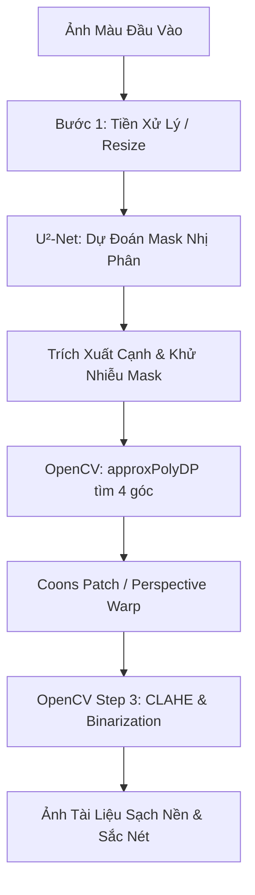
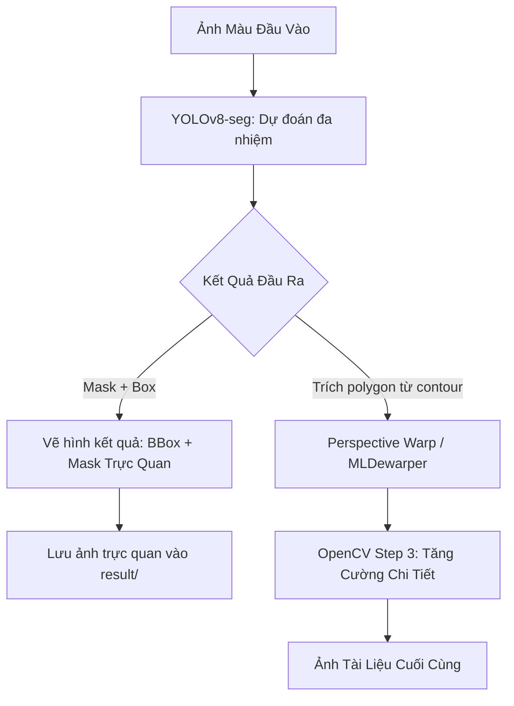

# Kế hoạch chi tiết: Huấn luyện (Re-build), Đánh giá & Tích hợp U²-Net và YOLOv8-seg vào Pipeline Quét Tài Liệu

Tài liệu này vạch ra lộ trình kỹ thuật chi tiết nhằm huấn luyện lại (fine-tune) mô hình **U²-Net** và **YOLOv8-seg** trên tập dữ liệu chuyên dụng về tài liệu, thiết lập bộ chỉ số đánh giá (KPI) so sánh giữa hai giải pháp, và tích hợp chúng một cách đồng bộ vào hệ thống **DocScannerMobile**.

---

## 1. Thiết Kế Hệ Thống & Luồng Tích Hợp Pipeline

### A. Tích hợp U²-Net (Giữ Nguyên Pipeline Truyền Thống)
Luồng tích hợp này sử dụng U²-Net như một công cụ tách nền triệt để (Background Remover) ở bước đầu, sau đó áp dụng các thuật toán OpenCV truyền thống để tìm góc và nắn thẳng.



### B. Tích hợp YOLOv8-seg (Thay Thế U²-Net & Vẽ Kết Quả)
Luồng tích hợp này thay thế U²-Net bằng YOLOv8-seg để thực hiện đồng thời hai nhiệm vụ: phân vùng (Segmentation Mask) và xác định khung bao (Bounding Box / Polygon).



---

## 2. Kế Hoạch Chuẩn Bị Dữ Liệu (Datasets)

Để mô hình học được chính xác biên dạng tài liệu trong các môi trường phức tạp (tay che, ánh sáng yếu, nền lộn xộn), chúng ta cần chuẩn bị tập dữ liệu huấn luyện đặc thù.

### A. Các Nguồn Dataset Gợi Ý
1. **SmartDoc Dataset:** Chứa các video và ảnh chụp tài liệu trên nhiều nền khác nhau, cực kỳ phù hợp cho bài toán di động.
2. **MIDV-2020 / MIDV-500:** Tập dữ liệu chuẩn quốc tế về hộ chiếu, thẻ căn cước và hóa đơn giấy trên nền thực tế phức tạp.
3. **Custom Dataset (Tự gán nhãn):** Tự thu thập và gán nhãn ảnh tài liệu thực tế của dự án bằng [Labelme](https://github.com/wkentaro/labelme). **Khuyến nghị số lượng ảnh hợp lý:**
   * **Cấp độ Prototype (PoC): 200 - 500 ảnh.** Đủ để fine-tune nhẹ mô hình pre-trained, chứng minh tính khả thi nhưng có thể thất bại ở các góc chụp tối hoặc nền quá dị.
   * **Cấp độ Sản Xuất (Production-ready): 1.000 - 3.000 ảnh.** Cần đa dạng hóa (tay che, bóng râm, hóa đơn nhàu nát, nền hoa văn lộn xộn). Đảm bảo model robust (chống chịu tốt) với người dùng cuối.
   * **Cấp độ SOTA (State-of-the-Art): 5.000 - 10.000+ ảnh.** Dành cho việc train model từ đầu (train from scratch) hoặc muốn đạt độ chính xác cực đoan 99% ở mọi điều kiện khắc nghiệt.

### C. 5 Kịch Bản Ảnh (Scenarios) Khó Cần Tập Trung Thu Thập
Để mô hình (đặc biệt là YOLO) không bị "học vẹt", bạn **không nên** chụp ảnh tài liệu vuông vắn trên nền bàn trống trơn. Hãy cố tình tạo ra dataset tập trung vào 5 bài toán (corner cases) sau đây:

1. **Occlusion (Bị che khuất):** 
   * *Nội dung:* Ngón tay người dùng đang cầm vào mép giấy hoặc đè lên một góc tài liệu.
   * *Mục đích:* Dạy model biết cách "cắt lách" qua ngón tay, giữ lại nguyên vẹn nội dung giấy thay vì cắt lẹm mất góc có tay cầm.
2. **Complex Backgrounds (Phông nền lộn xộn & Trùng màu):**
   * *Nội dung:* Tờ giấy trắng đặt trên mặt bàn trắng/xám sáng; hoặc xung quanh có vô số vật thể gây nhiễu (bàn phím, bút, cốc cà phê, thảm hoa văn rằn ri).
   * *Mục đích:* Giúp model phân biệt ranh giới cực kỳ mờ nhạt (low contrast) và không bị "bắt nhầm" cạnh của cái bút thành mép giấy.
3. **Lighting & Shadows (Ánh sáng & Bóng đổ):**
   * *Nội dung:* Có bóng của chính chiếc điện thoại đang cầm chụp đổ hắt ngang qua tờ giấy; hoặc chụp dưới ánh đèn lóa (glare) phản chiếu trên hóa đơn bóng bẩy; chụp trong điều kiện thiếu sáng.
   * *Mục đích:* Tránh việc model nhầm vệt bóng đổ (shadow boundary) thành viền của tờ giấy.
4. **Physical Deformations (Biến dạng vật lý):**
   * *Nội dung:* Tờ hóa đơn siêu thị dài, cong vểnh lên rớt khỏi mép bàn; giấy bị nhàu nát, có nếp gấp khúc; trang sách của một cuốn sách rất dày bị phồng cong ở gáy sách.
   * *Mục đích:* Chống lại các thuật toán hình học tuyến tính truyền thống, dạy model nhận biết "tài liệu" không phải lúc nào cũng là hình chữ nhật phẳng hoàn hảo.
5. **Varying Types & Aspect Ratios (Đa dạng tỷ lệ & loại giấy):**
   * *Nội dung:* Không chỉ chụp giấy A4, hãy chụp Thẻ căn cước/Bằng lái (viền nhựa/nền sẫm), Card visit nhỏ xíu, Biên lai máy POS, vé gửi xe.
   * *Mục đích:* Đa dạng hóa khái niệm "document" cho YOLO, không để nó mặc định giấy luôn là tỷ lệ 3:4 hoặc 9:16 màu trắng.

### B. Định Dạng Dữ Liệu Cho Từng Mô Hình
* **Cho U²-Net:** 
  * Cấu trúc thư mục dạng:
    ```
    dataset/
      ├── train/
      │     ├── images/ (ảnh gốc .jpg)
      │     └── masks/  (ảnh mặt nạ trắng đen .png)
      └── val/
            ├── images/
            └── masks/
    ```
* **Cho YOLOv8-seg:**
  * Chuyển đổi nhãn đa giác (polygon) từ Labelme sang định dạng YOLO Segmentation:
    `[class_id] [x1] [y1] [x2] [y2] ... [xn] [yn]` (tọa độ chuẩn hóa về khoảng `0.0 - 1.0`).

---

## 3. Quy Trình Huấn Luyện & Tinh Chỉnh Mô Hình (Training & Tuning)

### 3.1. Đối Với U²-Net (Tách Nền Văn Bản)
Chúng ta sẽ viết mã nguồn huấn luyện bằng PyTorch, sử dụng kiến trúc **U²-Net** (176.3MB) hoặc **U²-Netp** (4.7MB - khuyên dùng cho thiết bị di động).

* **Hàm Mất Mát (Loss Function):** Kết hợp giữa **Binary Cross Entropy (BCE)** và **Intersection over Union (IoU) Loss** để tối ưu biên sắc nét:
  $$\mathcal{L}_{total} = \mathcal{L}_{BCE} + \mathcal{L}_{IoU}$$
* **Chiến lược Tinh Chỉnh (Tuning):**
  * Tốc độ học (Learning Rate): Khởi tạo $1e-3$, giảm dần bằng Cosine Annealing.
  * Tăng cường dữ liệu (Data Augmentation): Lật ngang/dọc, xoay ngẫu nhiên, thay đổi độ sáng/tương phản (để mô phỏng bóng đổ) và biến dạng phối cảnh (Perspective Warp).
* **Các chỉ số theo dõi trong quá trình huấn luyện:**
  * **Train/Val Loss** qua từng epoch.
  * **Mean IoU (mIoU)** và **F1-Score (Dice Coefficient)** trên tập Validation.

### 3.2. Đối Với YOLOv8-seg (Đa Nhiệm: Xóa Nền & Phát Hiện BBox)
Sử dụng thư viện `ultralytics` để huấn luyện cực kỳ nhanh chóng và hiệu quả.

* **Lệnh chạy huấn luyện:**
  ```bash
  yolo segment train \
    data=docs_ml2/doc_seg.yaml \
    model=yolov8n-seg.pt \
    epochs=50 \
    imgsz=640 \
    batch=16 \
    device=0
  ```
* **Chiến lược Tinh Chỉnh (Tuning):**
  * Thử nghiệm các phiên bản kích thước model khác nhau: `yolov8n-seg.pt` (siêu nhẹ, nhanh) vs `yolov8s-seg.pt` (chính xác hơn).
  * Điều chỉnh siêu tham số `box` loss, `cls` loss và `dfl` loss để cân bằng giữa phát hiện khung bao và phân vùng điểm ảnh.
* **Các chỉ số theo dõi:**
  * **Box mAP50 / mAP50-95** (Chất lượng phát hiện bounding box).
  * **Mask mAP50 / mAP50-95** (Chất lượng của phân đoạn mặt nạ).

---

## 4. Kế Hoạch Tích Hợp Vào Pipeline Hệ Thống

### 4.1. Tích Hợp U²-Net (Giữ Nguyên Pipeline Cũ)
* **Vị Trí Tích Hợp:** Tại file [Pipeline With ML/main.py](file:///Users/binhpham/Documents/Study/MSE/ML%202/Final_deeplearning/Pipeline%20With%20ML/main.py).
* **Logic Hoạt Động:**
  1. Khi người dùng truyền cờ `--u2net`, gọi model U²-Net đã fine-tune để loại bỏ 100% background, chừa lại vùng tài liệu trên nền trắng tinh khiết (`u2net_doc`).
  2. Dùng thuật toán `cv2.findContours` và `cv2.approxPolyDP` trên mặt nạ để tìm chính xác tọa độ 4 góc.
  3. Đưa ảnh tài liệu đã sạch nền vào bước **Step 2 (Perspective Warp / Coons Patch)** và **Step 3 (Enhancement)** để tạo ảnh quét tối ưu.

### 4.2. Tích Hợp YOLOv8-seg (Thay Thế U²-Net & Vẽ Kết Quả)
* **Vị Trí Tích Hợp:** Khởi tạo một lớp segmentor mới tại `Pipeline With ML/step1_yolo_seg.py` hoặc cập nhật lớp `YOLOSegmentor` tại [Pipeline With ML/step1_ml_segmentor.py](file:///Users/binhpham/Documents/Study/MSE/ML%202/Final_deeplearning/Pipeline%20With%20ML/step1_ml_segmentor.py).
* **Logic Hoạt Động:**
  1. Thay vì chỉ lấy mask, YOLOv8-seg trả về đồng thời: **Bounding Box**, **Mask Contour (Polygon)** và **Confidence Score**.
  2. **Trực quan hóa kết quả (Drawing component):** Vẽ một khung chữ nhật màu xanh lá cây quanh tài liệu, phủ một lớp mask bán trong suốt (màu xanh lam, opacity 40%) lên vùng giấy, và ghi điểm số tin cậy (Confidence).
  3. **Lưu kết quả trực quan:** Ảnh vẽ hình kết quả sẽ được lưu tự động vào thư mục `result/` với tên dạng `{category}_{base_code}_yolo_vis.jpg`.
  4. Trích xuất thẳng 4 tọa độ góc từ đa giác bao ngoài của YOLO Mask và đẩy thẳng vào Step 2, bỏ qua khâu dò tìm góc thô của OpenCV giúp tăng tốc hệ thống.

---

## 5. Thiết Kế Bộ Chỉ Số Đo Lường & Đánh Giá (KPI & Metrics)

Để đánh giá một cách khoa học hiệu quả của từng model, chúng ta thiết lập hai nhóm KPI chính: **Độ chính xác (Accuracy)** và **Tốc độ xử lý (Speed)**.

### A. Bảng Tiêu Chí KPI Đo Lường
| Nhóm KPI | Tên Chỉ Số | Công Thức / Cách Đo | Ý Nghĩa Kỹ Thuật |
| :--- | :--- | :--- | :--- |
| **Độ Chính Xác** | **Intersection over Union (IoU)** | $\text{IoU} = \frac{|A \cap B|}{|A \cup B|}$ | Đo đạc mức độ trùng khớp giữa mask dự đoán và mask nhãn chuẩn. Càng cao càng tách nền sát biên giấy. |
| | **Dice Coefficient (F1-score)** | $\text{Dice} = \frac{2|A \cap B|}{|A| + |B|}$ | Đo độ hài hòa giữa Precision và Recall trên cấp độ điểm ảnh. |
| | **Corner Distance RMSE** | $\sqrt{\frac{1}{4}\sum_{i=1}^4 (x_i - \hat{x}_i)^2 + (y_i - \hat{y}_i)^2}$ | Sai số khoảng cách Euclid trung bình giữa 4 góc dự đoán so với góc nhãn chuẩn (đo bằng pixel). |
| **Tốc Độ & Tài Nguyên** | **Inference Time (Thời gian chạy)** | Đo bằng `time.perf_counter()` trung bình qua 50 ảnh test. | Đo tốc độ phản hồi của model trên CPU (M1/Intel Mac) và GPU. |
| | **FPS (Frames Per Second)** | $\text{FPS} = \frac{1000}{\text{Inference Time (ms)}}$ | Khả năng xử lý thời gian thực. |
| | **Model Size (Dung lượng tệp)** | Đo dung lượng file `.pt` hoặc `.onnx` trên ổ đĩa. | Tính cơ động khi triển khai lên thiết bị di động. |

### B. Mẫu Bảng So Sánh Đối Chứng (Benchmark Template)
Chúng ta sẽ chạy script đánh giá chéo trên tập kiểm thử (Test Set) gồm 50 ảnh khó để điền dữ liệu vào bảng sau:

| Model | Size (MB) | Mean IoU | F1-Score | Corner RMSE (px) | Inference Time (CPU M1 - ms) | FPS (CPU) | Trạng Thái Phù Hợp |
| :--- | :---: | :---: | :---: | :---: | :---: | :---: | :--- |
| **U²-Net (Full)** | ~176.3 | *Đang đo* | *Đang đo* | *Đang đo* | *Đang đo* | *Đang đo* | Phù hợp chạy server đám mây |
| **U²-Netp (Light)** | ~4.7 | *Đang đo* | *Đang đo* | *Đang đo* | *Đang đo* | *Đang đo* | Cân bằng tốt cho thiết bị di động |
| **YOLOv8n-seg (Custom)**| ~6.5 | *Đang đo* | *Đang đo* | *Đang đo* | *Đang đo* | *Đang đo* | Tốt nhất cho ứng dụng thời gian thực |

---

## 5.5. Đánh Giá Chuyên Sâu & Lựa Chọn Phiên Bản (Version Selection)

Dựa trên yêu cầu của một ứng dụng quét tài liệu di động (DocScannerMobile), bài toán đặt ra yêu cầu khắt khe về **tốc độ (chạy trên Edge Device/Mobile CPU)** và **độ sắc nét của đường biên (dành cho nắn phối cảnh)**. Dưới đây là đánh giá chi tiết để chọn ra phiên bản tối ưu nhất:

### A. Đối với dòng YOLO (Segmentation)
Các ứng viên: YOLOv8 (nano/small), YOLOv11 (nano).
* **YOLOv8n-seg (Nano):** Kích thước siêu nhẹ (~6.5MB), cực kỳ nhanh (có thể đạt >30 FPS trên CPU M1 hoặc mobile). Phù hợp nhất để định vị đa giác (polygon) và xác định vùng tài liệu. *Điểm yếu:* Mask ở viền có thể hơi thô ráp (răng cưa) so với các model nặng hơn.
* **YOLOv8s-seg (Small):** Nặng hơn (~22MB), viền mask mịn hơn một chút, nhưng tốc độ giảm đáng kể trên CPU thuần.
* **YOLOv11n-seg:** Cấu trúc mới, tuy nhiên YOLOv8n-seg hiện tại có hệ sinh thái export sang ONNX/CoreML/TFLite cho mobile ổn định và toàn diện hơn.
* **Đề xuất chốt:** **YOLOv8n-seg** là lựa chọn hoàn hảo. Trong bài toán Document Scanner, chúng ta chỉ cần YOLO tìm chính xác 4 đỉnh đa giác (từ contour của mask). Sự thô ráp nhỏ ở viền mask không ảnh hưởng lớn đến kết quả nắn phẳng (Dewarping) nếu 4 góc đã chuẩn.

### B. Đối với dòng U²-Net (Salient Object Detection)
Các ứng viên: U²-Net (Full) và U²-Netp (Lightweight).
* **U²-Net (Full - 176MB):** Mang lại chất lượng tách nền hoàn hảo, viền giấy sắc lẹm, phân biệt cực tốt tay người và nền phức tạp. *Điểm yếu:* Quá nặng và chậm (~1 - 2 giây/ảnh trên CPU), gây trải nghiệm giật lag nếu chạy offline trên điện thoại.
* **U²-Netp (4.7MB):** Phiên bản rút gọn cực nhẹ, tốc độ nhanh hơn nhiều lần. *Điểm yếu:* Mất đi một phần khả năng giữ chi tiết sắc nét ở rìa giấy và dễ bị nhiễu hơn với nền có kết cấu giống giấy.
* **Đề xuất chốt:** 
  * Nếu ứng dụng chạy **Offline trên điện thoại (Edge AI):** Bắt buộc dùng **U²-Netp**. Cần bù đắp độ mờ viền bằng các thuật toán xử lý ảnh truyền thống (như Morphological Operations ở Step 3).
  * Nếu ứng dụng gọi API xử lý qua **Server Backend:** Dùng **U²-Net (Full)** để tận dụng sức mạnh phần cứng máy chủ, đảm bảo chất lượng nhổ nền hoàn hảo nhất làm đầu vào cho `UVDocDewarper`.

---

## 6. Kế Hoạch Triển Khai Chi Tiết (Roadmap)

Kế hoạch được chia thành 4 giai đoạn rõ ràng trong thư mục `docs_ml2`:

### Giai Đoạn 1: Chuẩn Bị & Thiết Lập Môi Trường (Ngày 1 - 2)
* [ ] Khởi tạo thư mục `docs_ml2/` trong dự án.
* [ ] Thu thập hình ảnh, chuẩn bị tập dữ liệu 150 ảnh tài liệu đa dạng góc chụp và bối cảnh.
* [ ] Tiến hành gán nhãn đa giác (polygon) bằng công cụ Labelme để xuất định dạng JSON.
* [ ] Tạo các script convert dữ liệu sang định dạng nhị phân (cho U2Net) và YOLO (cho YOLOv8-seg).

### Giai Đoạn 2: Huấn Luyện & Đánh Giá Từng Model (Ngày 3 - 5)
* [ ] Xây dựng file cấu hình huấn luyện `doc_seg.yaml` cho YOLOv8-seg.
* [ ] Chạy huấn luyện YOLOv8-seg với số lượng 50 epochs, thu thập các biểu đồ Loss, Precision, Recall và mAP.
* [ ] Viết mã nguồn training cho U²-Net bằng PyTorch với việc tích hợp các phép tăng cường dữ liệu phối cảnh nâng cao.
* [ ] Huấn luyện cả hai phiên bản U²-Net và U²-Netp. Lưu lại các trọng số có IoU tốt nhất trên tập Validation.

### Giai Đoạn 3: Tích Hợp Hệ Thống Vào Pipeline (Ngày 6 - 7)
* [ ] **Tích hợp U²-Net:** Tích hợp trọng số mới đã train vào luồng `--u2net` hiện tại trong file `main.py`, tinh chỉnh các ngưỡng nhị phân để lọc nhiễu ngón tay hoặc biên ngoài.
* [ ] **Tích hợp YOLOv8-seg:** 
  * Cập nhật module `YOLOSegmentor` tại `step1_ml_segmentor.py` sử dụng model custom mới.
  * Viết hàm trực quan hóa kết quả: vẽ khung chữ nhật bao ngoài, tô màu mask bán trong suốt, ghi chỉ số tin cậy. Lưu ảnh minh họa vào thư mục `result/`.
  * Trích xuất góc trực tiếp từ YOLO polygon để chuyển tiếp vào bước Dewarping của Step 2.

### Giai Đoạn 4: Đo Đạc Đánh Giá KPI & Hoàn Thiện Báo Cáo (Ngày 8)
* [ ] Viết script `benchmark_ml2.py` tự động đo thời gian inference và tính IoU/Dice của cả hai mô hình trên 50 ảnh test.
* [ ] Lập bảng so sánh đối chứng chi tiết về tốc độ (Inference Time, FPS) và độ chính xác (IoU, Corner RMSE).
* [ ] Hoàn thành báo cáo khoa học cuối kỳ lưu trữ trong `docs_ml2/`.
