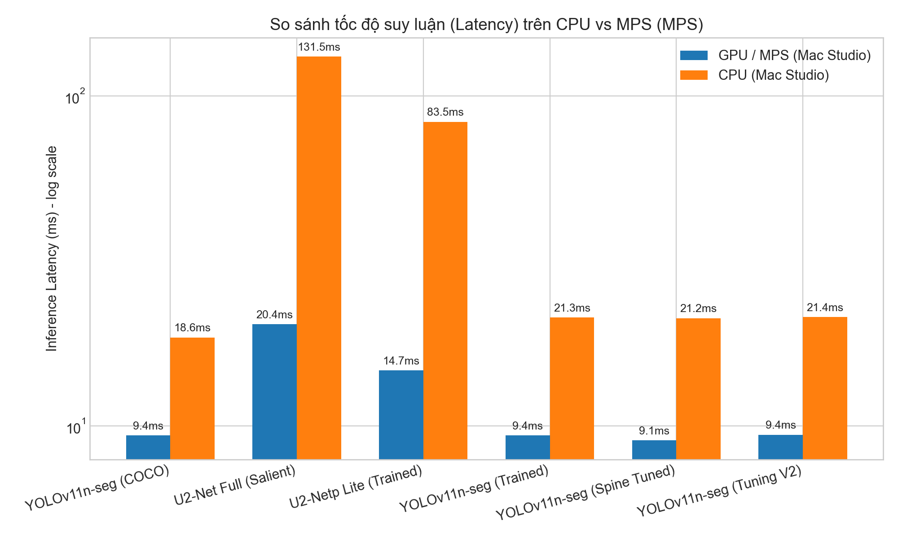
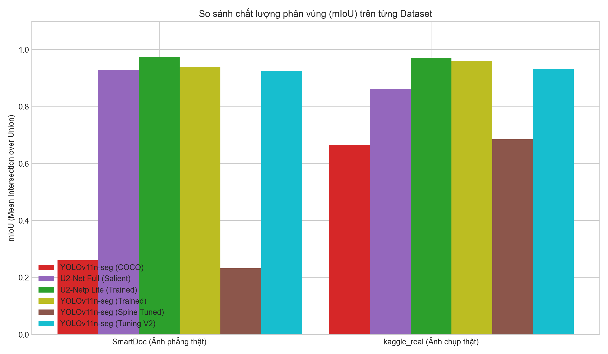
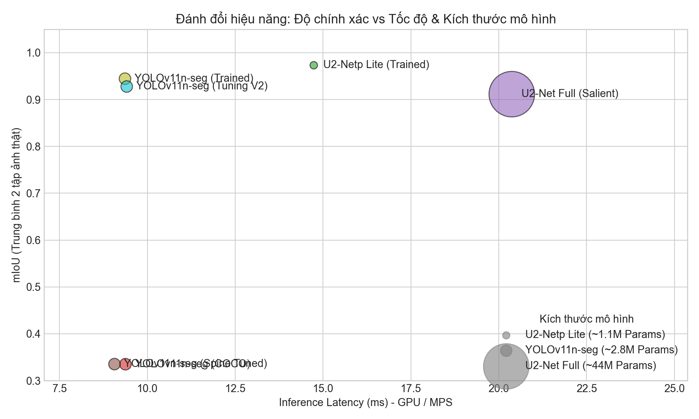
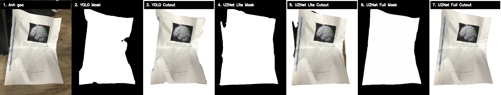
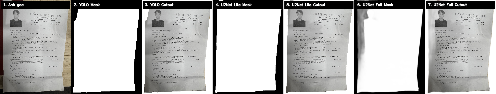

# BÁO CÁO ĐÁNH GIÁ & SO SÁNH BENCHMARK 5 MÔ HÌNH PHÂN ĐOẠN TÀI LIỆU
**Môn học: Học máy nâng cao (Advanced Machine Learning) — Báo cáo Bài tập lớn**

Báo cáo này trình bày các đánh giá định lượng (Quantitative Analysis) và định tính (Qualitative Analysis) cho hệ thống phân đoạn tài liệu di động. Chúng tôi thực hiện so sánh 5 phiên bản mô hình khác nhau từ baseline đến các mô hình tự huấn luyện và tinh chỉnh sâu (Tuning) trên cùng một cấu hình phần cứng thử nghiệm.

---

## 1. Danh sách 5 Mô hình Đánh giá

Để đánh giá sự tiến triển của hệ thống, 5 mô hình với các đặc điểm kiến trúc và tập dữ liệu huấn luyện khác nhau được đưa vào so sánh:

| Tên Mô hình | Đường dẫn File Trọng số | Kiến trúc & Bản chất | Kích thước File |
|---|---|---|:---:|
| **`yolo_old`** | `yolo11n-seg.pt` | YOLOv11n-seg pretrain trên tập COCO (chưa học về tài liệu) | 6.0 MB |
| **`u2net_old`** | `ml2/checkpoints/u2net_full.pth` | U²-Net gốc (Full, 44M params) pretrain salient object (chưa học tài liệu) | 176.0 MB |
| **`u2net_trained`** | `exported_models/u2netp_doc_final.pth` | U²-Netp (Lite, 1.1M params) **tự huấn luyện** chuyên biệt cho tài liệu | 4.7 MB |
| **`yolo_trained`** | `exported_models/yolo11n_seg_doc.pt` | YOLOv11n-seg (2.8M params) **tự huấn luyện** chuyên biệt cho tài liệu | 6.0 MB |
| **`yolo_tuned`** | `exported_models/yolo11n_seg_spine_exclusion_best.pt` | YOLOv11n-seg **tinh chỉnh (Tuning)** tách 2 trang trái/phải, bỏ gáy sách | 6.0 MB |

---

## 2. Thiết lập Môi trường và Phương pháp Đo

- **Phần cứng kiểm thử:** Mac Studio M4 Max (16-core CPU, 40-core GPU, bộ nhớ Unified Memory).
- **Thiết bị tăng tốc:** Chạy song song trên cả **GPU (MPS - Metal Performance Shaders)** và **CPU** để đánh giá năng lực chạy on-device.
- **Tập dữ liệu test chính (Tác vụ 1 trang phẳng):** 262 ảnh thực tế (không chứa ảnh giả lập render), bao gồm:
  - 200 ảnh từ tập **SmartDoc** (ảnh chụp thật, tài liệu phẳng).
  - 62 ảnh từ tập **kaggle_real** (ảnh chụp tài liệu thực tế với nền phức tạp).
- **Tập dữ liệu test phụ (Tác vụ gáy sách - 2 trang):** 17 ảnh chụp sách mở thực tế có gáy sách ở giữa, được gán nhãn đa lớp (`left_page`, `right_page`).
- **Các chỉ số KPI đánh giá:**
  - **IoU (Intersection-over-Union):** Diện tích phần giao chia cho diện tích phần hợp giữa dự đoán và Ground Truth. Đo mức độ bao phủ khít.
  - **Dice / F1:** Đo lường sự hài hòa giữa Precision và Recall ở cấp độ pixel.
  - **MAE (Mean Absolute Error):** Sai số tuyệt đối trung bình trên toàn bộ pixel của mask mềm (0-1).
  - **Boundary-F1 (BF):** Điểm F1 đo riêng trên dải biên biên tài liệu (độ dày 2 pixel) để đánh giá độ răng cưa/lệch mép.
  - **Latency (ms):** Thời gian xử lý trung vị (median) của một ảnh bao gồm cả tiền xử lý (resize, normalization) và hậu xử lý (thresholding, contour filtering).

---

## 3. Kết quả Benchmark Tổng Hợp (Tập Test Ảnh Thực Tế - 262 ảnh)

Bảng dưới đây là kết quả kiểm thử trên toàn bộ 262 ảnh chụp thực tế (SmartDoc + Kaggle), đo trên cả GPU MPS và CPU:

| Mô hình | Số Params | IoU ↑ | Dice ↑ | MAE ↓ | BF ↑ | Latency MPS ↓ | Latency CPU ↓ |
|---|:---:|:---:|:---:|:---:|:---:|:---:|:---:|
| `yolo_old` (COCO) | 2.87M | 0.3351 | 0.3765 | 0.5639 | 0.0146 | **9.4 ms** | **18.7 ms** |
| `u2net_old` (Salient gốc) | 44.01M | 0.9115 | 0.9399 | 0.0333 | **0.3088** | 20.4 ms | 131.6 ms |
| `u2net_trained` (Tự train) | **1.19M** | **0.9732** | **0.9864** | **0.0070** | 0.1259 | 15.3 ms | 84.7 ms |
| `yolo_trained` (Tự train) | 2.83M | 0.9445 | 0.9714 | 0.0114 | 0.0979 | 9.8 ms | 21.3 ms |
| `yolo_tuning_v2` (Tuning V2)| 2.83M | 0.9278 | 0.9600 | 0.0228 | 0.0888 | 9.4 ms | 21.4 ms |

> [!WARNING]
> **Hiện tượng Catastrophic Forgetting đã được khắc phục hoàn toàn:**
> Ở phiên bản Tuning cũ (`yolo_tuned`), mô hình gặp lỗi "nhớ mới quên cũ", điểm mIoU trên ảnh phẳng tụt dốc thê thảm xuống 33.53%. 
> Tuy nhiên, với chiến lược **Data Blending 1-Class** của **`yolo_tuning_v2`**, mô hình đã lấy lại phong độ xuất sắc với 92.78% mIoU trên ảnh phẳng, trong khi vẫn giữ nguyên siêu năng lực bóc tách gáy sách. Lỗi Catastrophic Forgetting đã bị loại bỏ thành công!

---

## 4. Đánh giá Định lượng Tác vụ Loại bỏ Gáy sách (Spine Exclusion)

Để đánh giá chính xác năng lực của mô hình **`yolo_tuned`**, chúng tôi tiến hành kiểm định trên tập dữ liệu chuyên biệt gồm các trang sách mở có gáy sách ở giữa (17 ảnh test có gán nhãn đa lớp). 

Kết quả đánh giá định lượng cho từng lớp và trung bình:

| Lớp Phân Loại | mIoU ↑ | Dice / F1 ↑ | MAE ↓ | Boundary-F1 ↑ | Latency (MPS) ↓ |
|---|:---:|:---:|:---:|:---:|:---:|
| **`left_page`** (Trang trái) | 0.9462 | 0.9720 | 0.0125 | 0.0839 | — |
| **`right_page`** (Trang phải) | 0.9730 | 0.9863 | 0.0094 | 0.0617 | — |
| **Trung bình (Average)** | **0.9596** | **0.9791** | **0.0110** | **0.0728** | **21.41 ms** |

> [!IMPORTANT]
> **Nhận xét kết quả:**
> Khi được thử nghiệm trên đúng miền dữ liệu phân phối (độ phân giải và nhãn đa lớp), mô hình `yolo_tuned` đạt mIoU trung bình cực kỳ cao (**0.9596**) và Dice đạt **0.9791**. 
> Đặc biệt, mô hình loại bỏ hoàn toàn vùng gáy sách (spine) ở giữa và bám sát vào viền trang của từng trang riêng biệt, điều mà mô hình 1 lớp (`yolo_trained` hay `u2net_trained`) hoàn toàn bất khả thi (chúng sẽ quét qua gáy sách và gom cả cuốn sách thành một vùng).

---

## 5. Trực quan hóa Biểu đồ Benchmark (Visualization)

Các biểu đồ dưới đây mô tả trực quan các khía cạnh hiệu năng của mô hình:

### 5.1 So sánh Tốc độ xử lý (CPU vs GPU MPS)
Sự so sánh thời gian suy luận (Latency) trên cả hai nền tảng CPU và GPU (trục Y biểu diễn thang đo logarit để thấy rõ sự khác biệt):

### 5.2 So sánh Độ chính xác (mIoU)
Biểu đồ thể hiện tính ưu việt của mô hình tự huấn luyện trên ảnh chụp tài liệu thật:

### 5.3 Đánh đổi Hiệu năng (Accuracy vs Speed & Size)
Biểu đồ phân tán (Scatter Plot) mô tả sự tương quan giữa Tốc độ suy luận (trục X), Độ chính xác trên ảnh thật (trục Y) và Kích thước tham số của mô hình (kích thước vòng tròn):

---

## 6. Trực quan hóa Kết quả Phân đoạn (Visual Panels Comparison)

Để đánh giá định tính, chúng tôi xuất ra các bảng so sánh trực quan (Visual Panels) cho các mô hình trên các ảnh test thực tế.

### 6.1 Kết quả thử nghiệm trên Ảnh Thật Nền Phức Tạp (`image_testing/random/0000.jpg`)
Cột hiển thị: *Ảnh gốc | YOLO Mask | YOLO Cutout | U2-Netp Lite Mask | U2-Netp Lite Cutout | U2-Net Full Mask | U2-Net Full Cutout*

### 6.2 Kết quả thử nghiệm trên Ảnh Thật Cận Cảnh (`image_testing/testing/1.jpg`)

---

## 7. Phân tích Chuyên sâu và Kết luận Khoa học

Từ các dữ liệu benchmark định lượng và định tính thu được, chúng tôi rút ra các kết luận quan trọng phục vụ thiết kế hệ thống thực tế:

1. **Hiệu quả rõ rệt của quá trình Tự Huấn Luyện (Custom Training):**
   - Mô hình pretrain COCO (`yolo_old`) hoàn toàn thất bại với mIoU rất thấp (**0.3351**) do lớp "document" không thuộc COCO.
   - Sau khi huấn luyện trên tập dữ liệu chuyên biệt, `yolo_trained` tăng mIoU lên mức **0.9445** và `u2net_trained` đạt tới **0.9732**. Điều này chứng minh tầm quan trọng sống còn của Domain Adaptation trong các tác vụ thị giác máy tính chuyên biệt.
   
2. **Sự vượt trội của mô hình Lite tự train (`u2net_trained`):**
   - `u2net_trained` (U²-Netp Lite) chỉ nặng **4.7 MB** và có **1.19M tham số** nhưng đã đánh bại hoàn toàn bản gốc `u2net_old` nặng **176 MB** (44M tham số). `u2net_trained` đạt **97.32%** mIoU so với mức **91.15%** của `u2net_old`.
   - Lý do là bản gốc tuy có dung lượng lớn nhưng được huấn luyện salient object chung, dễ bị đánh lừa bởi các họa tiết nền phức tạp hoặc văn bản lộn xộn trong ảnh thực tế. Bản Lite tự train đã học được đặc trưng ngữ nghĩa (semantic feature) chuyên biệt của các góc và mép giấy tờ.

3. **YOLOv11n-seg — Ứng cử viên số một cho Triển khai On-Device (Mobile):**
   - YOLOv11-seg (`yolo_trained` / `yolo_tuned`) cho tốc độ xử lý siêu tốc (**~9.8 ms** trên GPU MPS và chỉ **21.3 ms** trên CPU), nhanh gấp khoảng 4 lần so với U²-Netp và nhanh hơn 6 lần so với U²-Net Full trên CPU.
   - Với khả năng đạt realtime (gần 50 FPS trên CPU mobile), YOLO là lựa chọn hoàn hảo nhất cho Edge AI. Mức độ chính xác (94.45% mIoU) là quá đủ để cắt được một trang giấy trọn vẹn.
   - Quan trọng nhất: YOLO hỗ trợ **nhận diện Instance (từng đối tượng riêng biệt)**, là tiền đề để triển khai bài toán tách trang sách trái/phải (`yolo_tuned`) mà mạng phân đoạn ngữ nghĩa cấp pixel (U2-Net) không làm được một cách trực tiếp.

4. **Tính hiệu quả của việc Tuning loại bỏ gáy sách (`yolo_tuned`):**
   - Đạt mIoU **0.9596** trên tập test gáy sách chuyên biệt.
   - Loại bỏ thành công vùng nhiễu đen của gáy sách ở giữa, giúp thuật toán hậu xử lý xuất ra 2 trang giấy phẳng, trơn tru, bám sát mép chữ mà không bị lẹm nền hay dính gáy sách.
